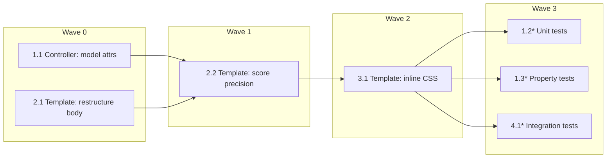

# Implementation Plan: Dashboard UX Enhancements

## Overview

A purely additive web-layer change. Two new model attributes (`activeSort`,
`activeType`) are wired into `DashboardController`, the existing
`templates/dashboard.html` is restructured (header bar, sort/type form,
result-count summary, score-header link, type badges, zebra/hover/sticky
styles, responsive layout), the inline `<style>` block is extended, and
the score formatter precision is tightened from two decimals to one. No
`pom.xml` changes, no new dependencies, no JavaScript files, no new
static assets. Tolerant parsing in the controller is preserved verbatim.

Test coverage is added at three layers: unit (`DashboardControllerTest`,
extended), property (`DashboardControllerPropertyTest`, new — two jqwik
properties), and integration (`DashboardControllerIT`, extended).

## Tasks

- [ ] 1. Wire new model attributes into `DashboardController`
  - [ ] 1.1 Expose `activeSort` and `activeType` on the model
    - Edit `src/main/java/com/example/searchengine/web/dashboard/DashboardController.java`.
    - In `dashboard(...)`, after the existing `parseSortOrNotify` /
      `parseTypeOrNotify` calls, add:
      `model.addAttribute("activeSort", effectiveSort);`
      `model.addAttribute("activeType", effectiveType);`
    - Do NOT modify `DEFAULT_LIMIT`, `ALLOWED_SORTS`, `ALLOWED_TYPES`,
      the method signature, or the two tolerant-parsing helpers.
    - Do NOT add any new field, new method, or import from
      `com.example.searchengine.infrastructure`.
    - _Requirements: 3.1, 3.2, 3.6, 9.2, 9.6, 10.5_

  - [ ]* 1.2 Extend `DashboardControllerTest` with model-attribute assertions
    - Edit `src/test/java/com/example/searchengine/web/dashboard/DashboardControllerTest.java`.
    - Add cases asserting that after every call the model contains
      `activeSort` and `activeType`.
    - Cover: valid lowercase (`sort=popularity`, `type=text`), mixed-case
      (`sort=ScOrE`), whitespace-padded (`sort="  relevance  "`), invalid
      (`sort=nope`, `type=alsonope`), `null` / blank input, and the
      `sort=relevance` forwarding to
      `searchService.listTop("relevance", null, 20)`.
    - _Requirements: 3.1, 3.2, 3.6, 9.2, 11.1_

  - [ ]* 1.3 Create `DashboardControllerPropertyTest` (jqwik)
    - Create `src/test/java/com/example/searchengine/web/dashboard/DashboardControllerPropertyTest.java`.
    - Instantiate `DashboardController` directly with a Mockito mock
      `SearchService` (mirror the existing unit-test setup); no Spring
      context, no Testcontainers.
    - **Property 1: `activeSort` tolerant-parsing contract**
      - **Validates: Requirements 3.1, 3.6, 9.2**
      - `@ForAll` arbitrary `String` (mix `null`, blank, random Unicode,
        and biased samples drawn from
        `{"score","popularity","relevance"}` with random casing /
        surrounding whitespace).
      - Assert `activeSort` is non-null, in
        `{"score","popularity","relevance"}`, equals
        `s.trim().toLowerCase()` when that is allowed, and equals
        `"score"` otherwise.
    - **Property 2: `activeType` tolerant-parsing contract**
      - **Validates: Requirements 3.2, 3.6, 9.2**
      - Same input strategy biased with `{"text","video"}`.
      - Assert `activeType` is in `{"text","video", null}`, equals
        `s.trim().toLowerCase()` when that is in `{"text","video"}`, and
        is `null` otherwise.
    - Both properties run at the project default of ≥ 100 iterations.
    - _Requirements: 3.1, 3.2, 3.6, 9.2_

- [ ] 2. Restructure `dashboard.html` body and tighten score formatting
  - [ ] 2.1 Restructure the template body
    - Edit `src/main/resources/templates/dashboard.html`.
    - In `<head>`, add `<meta name="viewport" content="width=device-width, initial-scale=1">`.
    - Replace the existing `<h1>Dashboard</h1>` with a header bar:
      `<header class="topbar"><span class="topbar__brand">Search Engine</span><span class="topbar__title">Dashboard</span></header>`.
    - Wrap the rest of the page content in `<main class="page">…</main>`.
    - Keep the existing ignored-notice block verbatim, including
      `data-testid="ignored-notice"` and the `th:if="${notice.hasMessages()}"` guard.
    - Add a sort/type form below the notice:
      `<form class="controls" method="get" action="/dashboard">` with two
      `<label class="controls__field">` blocks containing
      `<select name="sort">` (options `score`, `popularity`, `relevance`)
      and `<select name="type">` (options `""` / `text` / `video`),
      each option using `th:selected` against `activeSort` /
      `activeType` (use `${activeType == null}` to select the `All` option),
      followed by `<button class="controls__submit" type="submit">Apply</button>`.
    - Add a result-count summary `<p class="summary" data-testid="result-count">`
      that renders `Showing ${#lists.size(rows)}`, optionally the
      `activeType` word when set, then `results sorted by ${activeSort}`.
    - Wrap the table in `<div class="table-wrap">` for horizontal scroll on
      small viewports.
    - Score column header becomes a `Score_Header_Link`:
      `<th scope="col" class="score-col" th:classappend="${activeSort == 'score'} ? ' active-sort' : ''">`
      containing `<a th:href="@{/dashboard(sort='score', type=${activeType})}">Score<span th:if="${activeSort == 'score'}" aria-hidden="true"> ▼</span></a>`.
    - Each body row's type cell becomes
      `<td><span class="type-badge" th:classappend="' type-badge--' + ${row.type()}" th:text="${row.type()}">type</span></td>`.
    - Keep the existing empty-state block verbatim, including
      `data-testid="empty-message"` and the `th:if="${empty}"` guard.
    - Do NOT add any `<script>` tag or external `<link>` to a stylesheet.
    - _Requirements: 1.1, 1.2, 1.6, 2.1, 3.3, 3.4, 3.5, 5.1, 5.2, 5.3, 6.1, 6.5, 6.6, 7.1, 7.2, 7.3, 7.4, 8.1, 8.3, 9.4, 9.5, 10.1, 10.4_

  - [ ] 2.2 Tighten score formatting precision to one decimal
    - In the same `templates/dashboard.html`, change the score cell
      expression from
      `${#numbers.formatDecimal(row.score(), 1, 2)}` to
      `${#numbers.formatDecimal(row.score(), 1, 1)}`.
    - Update the placeholder literal text `0.00` to `0.0`.
    - Keep `class="score"` on the `<td>` so right-alignment + tabular
      figures still apply.
    - _Requirements: 4.1, 4.2_

- [ ] 3. Extend the inline `<style>` block in `dashboard.html`
  - [ ] 3.1 Add CSS rules for the new UI elements
    - Edit the inline `<style>` block in
      `src/main/resources/templates/dashboard.html`.
    - Replace the existing `body { margin: 2rem; … }` rule so page
      padding lives on `.page` instead, and `body` keeps only the
      font/color declarations.
    - Add the header-bar rules (`.topbar`, `.topbar__brand`,
      `.topbar__title`) using background `#0f172a` / foreground `#ffffff`.
    - Add the controls rules (`.controls`, `.controls__field`,
      `.controls__label`, `.controls__submit`).
    - Add the summary rule (`.summary`).
    - Promote the existing `thead th` rule to `position: sticky; top: 0;`
      with `z-index: 1` so the header stays visible while scrolling.
    - Add zebra striping (`tbody tr:nth-child(even) { background: #fafafa; }`)
      and row hover (`tbody tr:hover { background: #eef2ff; }`).
    - Add the score-header-link rules (`th.score-col a { color: inherit; text-decoration: none; }`,
      `th.score-col a:hover { text-decoration: underline; }`,
      `th.active-sort a { color: #1d4ed8; font-weight: 700; }`).
    - Add the type-badge rules (`.type-badge`, `.type-badge--text`
      with background `#1d4ed8`, `.type-badge--video` with background
      `#6d28d9`); foreground `#ffffff` to keep WCAG 2.1 AA ≥ 4.5:1
      contrast on both badges.
    - Add `.table-wrap { overflow-x: auto; }`.
    - Add the responsive media query
      `@media (max-width: 600px) { .page { padding: 1rem; } .controls { flex-direction: column; align-items: stretch; } .controls__field, .controls__submit { width: 100%; } }`.
    - All CSS stays inside the same `<style>` block; do NOT introduce a
      separate stylesheet file or `src/main/resources/static/` directory.
    - _Requirements: 5.4, 6.1, 6.2, 6.3, 6.4, 8.2, 8.3, 10.2_

- [ ] 4. Extend `DashboardControllerIT` with HTML-level assertions
  - [ ]* 4.1 Add new IT assertions
    - Edit `src/test/java/com/example/searchengine/web/dashboard/DashboardControllerIT.java`.
    - Add assertions that, when `GET /dashboard?sort=v` is issued for
      each `v ∈ {"score","popularity","relevance"}`, the rendered body
      matches `<option value="v"[^>]*selected[^>]*>`.
    - Add assertions that, when `GET /dashboard?type=v` is issued for
      each `v ∈ {"text","video"}`, the rendered body contains
      `<option value="v" selected>`, and that for the no-filter request
      `<option value="" selected>All</option>` is present.
    - Assert the result-count summary renders with
      `data-testid="result-count"` and contains `Showing 20` and
      `sorted by score` against the existing 22-row fixture, and
      `Showing 0` + `sorted by score` for the empty-fixture case.
    - Assert that with `?type=text` the summary text contains
      `Showing` and `text results sorted by score`.
    - Assert the Score header link `href` equals `/dashboard?sort=score`
      with no type filter, and `/dashboard?sort=score&amp;type=text`
      with `?type=text` (HTML-escaped ampersand).
    - Assert the Score `<th>` carries `class=...active-sort...` plus a
      `▼` glyph for `sort=score`, and does NOT carry `active-sort` for
      `sort=popularity`.
    - Assert the body contains `class="type-badge type-badge--text"` and
      `class="type-badge type-badge--video"` against the mixed-type
      fixture.
    - Assert the body contains the substring `100.0` and does NOT
      contain `100.00` (score-formatting regression guard).
    - Assert the body contains
      `<meta name="viewport" content="width=device-width, initial-scale=1">`
      and `@media (max-width: 600px)`.
    - Assert the body contains zero `<script` occurrences and no
      `<input` / `name="page"` / `name="q"` strings.
    - Keep all existing assertions on `data-testid="ignored-notice"`
      and `data-testid="empty-message"` intact.
    - _Requirements: 1.6, 3.3, 3.4, 3.5, 4.1, 5.1, 5.2, 5.3, 6.5, 6.6, 7.1, 7.2, 7.3, 7.4, 8.1, 8.2, 8.3, 9.3, 9.4, 9.5, 10.4, 11.2, 11.3, 11.4_

- [ ] 5. Final checkpoint
  - Run `mvnw.cmd -B test` and confirm Surefire (unit + property + ArchUnit) is green.
  - Run `mvnw.cmd -B verify` and confirm Failsafe (Testcontainers IT) is green.
  - Confirm `git diff pom.xml` reports zero lines changed.
  - Confirm no new files exist under `src/main/resources/static/`.
  - Confirm `DashboardController` has zero imports from
    `com.example.searchengine.infrastructure`.
  - Ensure all tests pass, ask the user if questions arise.

## Notes

- Tasks marked with `*` are optional and can be skipped for a faster MVP.
- Every task references the granular requirement clauses it satisfies.
- The implementation language is Java 21 (existing project stack); no
  language selection was needed for this feature.
- The two property tests both use the project-default jqwik iteration
  count (≥ 100 per property).
- Tasks 2.1, 2.2, and 3.1 all edit `templates/dashboard.html` and are
  serialised across waves to avoid edit conflicts. Task 1.1 edits
  `DashboardController.java` and is independent of the template tasks.
- The four test-related sub-tasks (1.2, 1.3, 4.1) depend on the
  implementation tasks they verify; they are scheduled in the final
  wave so the code under test is in place first.

## Task Dependency Graph

Mermaid view (waves shown as columns; tasks within the same wave run in
parallel; tasks in wave N can only start once all earlier waves have
finished):



Machine-readable wave schedule:

```json
{
  "waves": [
    { "id": 0, "tasks": ["1.1", "2.1"] },
    { "id": 1, "tasks": ["2.2"] },
    { "id": 2, "tasks": ["3.1"] },
    { "id": 3, "tasks": ["1.2", "1.3", "4.1"] }
  ]
}
```
