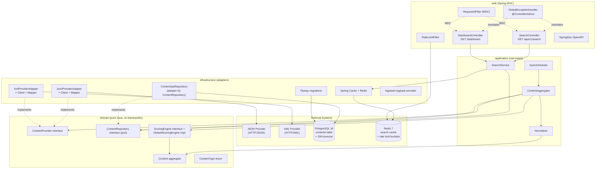
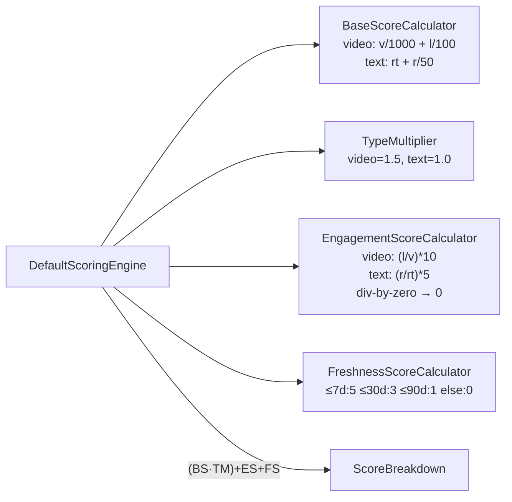
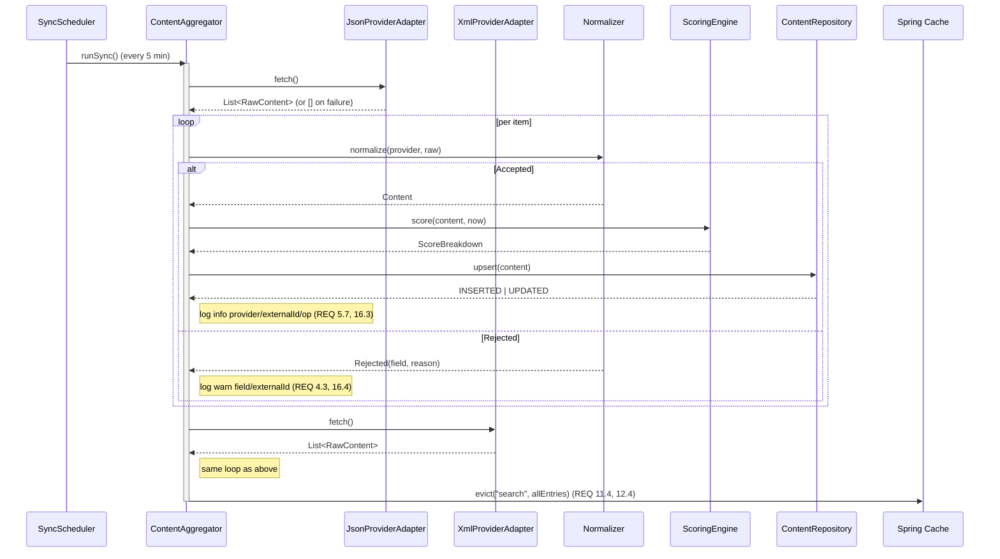
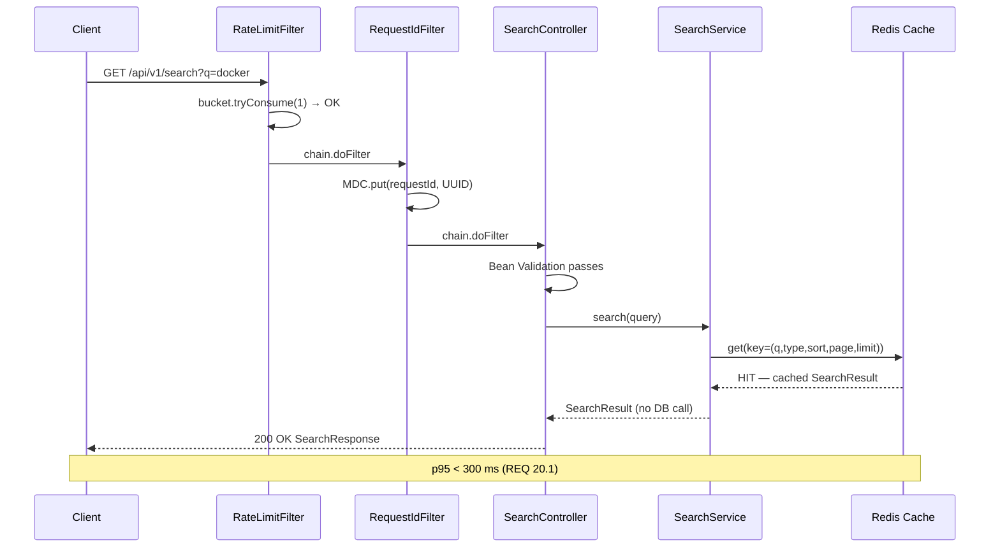

# Design Document — Search Engine Aggregator Service

## Overview

The Search Engine Aggregator Service is a Java 21 / Spring Boot 3.4+ backend that ingests content from heterogeneous external providers (one JSON-based, one XML-based), normalizes the data into a unified `Content` aggregate, computes a deterministic ranking score in a framework-free domain component, persists results in PostgreSQL with full-text search support, and exposes both a paginated REST search API and a server-rendered Thymeleaf dashboard.

The system is structured according to **Clean Architecture** with four packages — `domain`, `application`, `infrastructure`, `web` — and a strict inward dependency rule (no outer layer is importable from `domain`; `application` depends on `domain` only; `web` and `infrastructure` may depend on `application` and `domain`). The `Scoring_Engine` is implemented as a **pure-Java domain component** with zero framework imports, so it is independently unit-testable and immune to refactors of any outer layer (REQ 6.1, REQ 22.2).

Provider integrations follow the **Strategy Pattern**: a single `ContentProvider` interface in `domain.provider` is implemented once per source. Adding a new provider is a matter of registering a new Spring bean — the orchestrator (`Content_Aggregator`) discovers all `ContentProvider` beans by injection and never references concrete classes (REQ 1.1–1.6).

Cross-cutting concerns — caching (Redis via Spring Cache), rate limiting (Bucket4j-backed `OncePerRequestFilter`), structured logging (logstash-logback-encoder + MDC `requestId`), global exception translation (`@ControllerAdvice`), scheduled synchronization (`@Scheduled` with locking), and OpenAPI documentation (SpringDoc) — are all implemented in the `infrastructure` and `web` layers and configured through `@ConfigurationProperties` classes bound to `application.yaml`.

This document covers every requirement in `requirements.md` (REQ 1 through REQ 23). Each subsection cites the requirement IDs it addresses.

---

## Architecture

### High-Level Layered Architecture

The application is organized into four concentric layers. Inner layers know nothing about outer layers; outer layers depend only on layers strictly inside them. ArchUnit rules in the test suite enforce this at build time (REQ 22.1–22.4).



**Dependency rules (REQ 22.1–22.4):**

- `domain` imports nothing from `application`, `infrastructure`, or `web`, and nothing from `org.springframework`, `jakarta.persistence`, `com.fasterxml.jackson`, etc.
- `application` may import from `domain` only.
- `infrastructure` and `web` may import from `application` and `domain`.
- `web` may NOT import from `infrastructure` (controllers call application services only).

### Package Layout

```
com.example.searchengine
├── SearchengineApplication.java          (REQ 17, REQ 22)
│
├── domain/                                (PURE Java, no framework imports — REQ 22.1, 22.2)
│   ├── content/
│   │   ├── Content.java                   (aggregate — REQ 4.1, 5)
│   │   ├── ContentType.java               (enum: VIDEO, TEXT — REQ 4.5)
│   │   ├── ProviderName.java              (value object)
│   │   └── ContentRepository.java         (port — REQ 5, REQ 22.3)
│   ├── provider/
│   │   ├── ContentProvider.java           (Strategy interface — REQ 1.1)
│   │   ├── RawContent.java                (provider-agnostic raw payload)
│   │   └── ProviderFetchResult.java
│   └── scoring/
│       ├── ScoringEngine.java             (pure-Java interface — REQ 6.1, 22.2)
│       ├── DefaultScoringEngine.java      (impl — REQ 6, 7)
│       ├── BaseScoreCalculator.java
│       ├── TypeMultiplier.java
│       ├── EngagementScoreCalculator.java
│       └── FreshnessScoreCalculator.java
│
├── application/                            (use-cases — REQ 22)
│   ├── search/
│   │   ├── SearchService.java             (REQ 8, 9, 12)
│   │   ├── SearchQuery.java               (input record — REQ 8, 9)
│   │   └── SearchResult.java
│   ├── ingest/
│   │   ├── ContentAggregator.java         (orchestrator — REQ 1.3, 11.2)
│   │   ├── Normalizer.java                (REQ 4, 19.4)
│   │   └── NormalizationResult.java
│   └── scheduler/
│       └── SyncScheduler.java             (REQ 11)
│
├── infrastructure/
│   ├── persistence/
│   │   ├── ContentEntity.java             (JPA — REQ 5)
│   │   ├── ContentJpaRepository.java      (Spring Data — REQ 5.1, 5.2)
│   │   ├── ContentRepositoryAdapter.java  (port impl — REQ 22.3)
│   │   └── db/migration/V1__init.sql      (Flyway — REQ 5.4, 5.5)
│   ├── provider/
│   │   ├── jsonprovider/
│   │   │   ├── JsonProviderAdapter.java   (REQ 2)
│   │   │   ├── JsonProviderClient.java
│   │   │   ├── JsonContentDto.java
│   │   │   └── JsonContentMapper.java     (REQ 2.3)
│   │   └── xmlprovider/
│   │       ├── XmlProviderAdapter.java    (REQ 3)
│   │       ├── XmlProviderClient.java
│   │       ├── XmlFeedDto.java
│   │       └── XmlContentMapper.java      (REQ 3.2, 3.3)
│   ├── cache/
│   │   ├── CacheConfig.java               (REQ 12)
│   │   └── SearchCacheKeyGenerator.java   (REQ 12.1)
│   ├── ratelimit/
│   │   ├── RateLimitFilter.java           (REQ 13)
│   │   └── RateLimitProperties.java
│   ├── logging/
│   │   ├── RequestIdFilter.java           (REQ 16.2)
│   │   └── logback-spring.xml             (REQ 16.1)
│   └── config/
│       ├── ProviderProperties.java        (REQ 18)
│       ├── AggregatorProperties.java
│       ├── CacheProperties.java
│       ├── RateLimitProperties.java
│       └── ConfigValidator.java           (REQ 18.3, 18.4)
│
└── web/                                    (HTTP layer — REQ 22.4)
    ├── api/
    │   ├── SearchController.java          (REQ 8, 9)
    │   ├── SearchRequest.java             (DTO — REQ 22.5)
    │   ├── SearchResponse.java            (DTO — REQ 9.10)
    │   └── ContentSummaryDto.java
    ├── dashboard/
    │   ├── DashboardController.java       (REQ 10)
    │   └── templates/dashboard.html       (Thymeleaf — REQ 10.1, 10.2)
    ├── error/
    │   ├── GlobalExceptionHandler.java    (REQ 14)
    │   └── ErrorResponse.java
    └── openapi/
        └── OpenApiConfig.java             (REQ 15)
```

---

## Components and Interfaces

This section defines the public Java interfaces for the cross-layer abstractions called out in the architectural constraints. Each signature reflects the requirement IDs it serves.

### `ContentProvider` (Strategy Pattern, domain layer) — REQ 1

```java
// File: domain/provider/ContentProvider.java
// NO framework imports.
package com.example.searchengine.domain.provider;

import java.util.List;

public interface ContentProvider {

    /** Stable, unique identifier of this provider (e.g. "provider1-json"). REQ 1.1, 1.5 */
    String name();

    /**
     * Fetches a snapshot of raw content from the underlying source.
     * Implementations MUST NOT throw checked exceptions on transport-level
     * failures — they SHALL log and return an empty list (REQ 2.4, 2.6, 3.6, 21.3).
     *
     * @return immutable list of raw content items, never null
     */
    List<RawContent> fetch();
}
```

`RawContent` is a provider-agnostic record carrying the union of all mapped fields (REQ 2.3, REQ 3.2). Concrete `Provider_Adapter` implementations live in `infrastructure.provider.*` and are wired as Spring `@Component`s; the application layer (`Content_Aggregator`) injects `List<ContentProvider>` and iterates without knowing concrete types (REQ 1.3).

### `Normalizer` (application layer) — REQ 4, REQ 19.4

```java
// File: application/ingest/Normalizer.java
package com.example.searchengine.application.ingest;

import com.example.searchengine.domain.content.Content;
import com.example.searchengine.domain.provider.RawContent;

public interface Normalizer {

    /**
     * Validates and converts a raw provider payload into a Content domain entity.
     * Returns NormalizationResult.rejected(...) instead of throwing for invalid
     * input so that batch processing can continue (REQ 4.3, 4.4, 5.6).
     *
     * Sanitization: control characters in title/description except \t \n \r are
     * stripped per REQ 19.4.
     */
    NormalizationResult normalize(String providerName, RawContent raw);
}
```

`NormalizationResult` is a sealed type with two cases: `Accepted(Content)` and `Rejected(String fieldName, String reason)`. The `Content_Aggregator` logs rejections with the offending field name and continues (REQ 4.3, REQ 16.4).

### `ScoringEngine` (domain layer, pure Java) — REQ 6, REQ 7, REQ 22.2

```java
// File: domain/scoring/ScoringEngine.java
// PURE JAVA. No Spring, no JPA, no Jackson. Verified by ArchUnit (REQ 22.2, 23.5).
package com.example.searchengine.domain.scoring;

import com.example.searchengine.domain.content.Content;
import java.time.Instant;

public interface ScoringEngine {

    /**
     * Computes the deterministic Final_Score for a Content snapshot at a given
     * evaluation timestamp.
     *
     * Determinism: invoking this method twice with the same Content snapshot
     * and the same evaluationAt MUST return identical numeric values (REQ 6.10).
     *
     * Time injection: evaluationAt is an explicit parameter — implementations
     * MUST NOT call System.currentTimeMillis() / Instant.now() (REQ 7.5).
     *
     * @param content       immutable Content snapshot, must not be null
     * @param evaluationAt  evaluation timestamp, must not be null
     * @return ScoreBreakdown containing baseScore, typeMultiplier,
     *         engagementScore, freshnessScore, finalScore (REQ 6.9)
     */
    ScoreBreakdown score(Content content, Instant evaluationAt);
}
```

`DefaultScoringEngine` composes four collaborators — `BaseScoreCalculator`, `TypeMultiplier`, `EngagementScoreCalculator`, `FreshnessScoreCalculator` — each a pure function. Division-by-zero is guarded explicitly: video with `views == 0` and text with `reading_time == 0` produce `engagementScore = 0` (REQ 6.8).

### `ContentRepository` (port, domain layer) — REQ 5, REQ 22.3

```java
// File: domain/content/ContentRepository.java
// PURE JAVA — no JPA imports here. The JPA implementation lives in infrastructure.
package com.example.searchengine.domain.content;

import java.util.List;
import java.util.Optional;
import java.util.UUID;

public interface ContentRepository {

    /**
     * Inserts the Content if (provider, externalId) is new, otherwise updates
     * the existing row. Implemented as a single SQL upsert in PostgreSQL
     * via INSERT ... ON CONFLICT (provider, external_id) DO UPDATE (REQ 5.2).
     *
     * @return UpsertOutcome.INSERTED or UpsertOutcome.UPDATED (REQ 5.7)
     */
    UpsertOutcome upsert(Content content);

    /**
     * Full-text search against the title || description tsvector (REQ 5.5, 8.2),
     * filtered, sorted, and paginated according to the SearchCriteria. The
     * implementation uses parameterized queries — no string concatenation of
     * user input (REQ 19.3).
     *
     * @return at most limit rows (REQ 20.3)
     */
    SearchPage search(SearchCriteria criteria);

    Optional<Content> findById(UUID id);
}
```

`SearchCriteria` is a record `{String q, ContentType type, SortField sort, int page, int limit}`. Sorts: `SCORE` (default, by `final_score DESC`), `POPULARITY` (`popularity_score DESC`), `RELEVANCE` (`ts_rank` DESC) — all with deterministic tie-break by `id ASC` (REQ 9.3–9.6, REQ 10.3).

### `SearchService` (application layer) — REQ 8, REQ 9, REQ 12

```java
// File: application/search/SearchService.java
package com.example.searchengine.application.search;

public interface SearchService {

    /**
     * Executes a validated search query. The caller (controller) is
     * responsible for input validation (REQ 19.1); this service trusts its
     * input shape but still escapes FTS metacharacters (REQ 8.5).
     *
     * Caching: the @Cacheable annotation on the implementation keys on the
     * 5-tuple (q, type, sort, page, limit) into the "search" cache region
     * (REQ 12.1). Cache backend failure falls through transparently (REQ 12.7).
     */
    SearchResult search(SearchQuery query);
}
```

---

## Data Models

### `Content` Aggregate (domain) — REQ 4.1, REQ 5

```java
package com.example.searchengine.domain.content;

import java.time.Instant;
import java.util.List;
import java.util.UUID;

public record Content(
        UUID id,
        String provider,         // REQ 4.2
        String externalId,       // REQ 1, REQ 5.1 (unique with provider)
        String title,            // REQ 4.3 (non-empty)
        String description,
        ContentType type,        // REQ 4.5 (VIDEO or TEXT only)
        long views,              // REQ 4.4 (>= 0)
        long likes,              // REQ 4.4 (>= 0)
        int readingTime,         // REQ 4.4 (>= 0)
        long reactions,          // REQ 4.4 (>= 0)
        String duration,         // free-form for video, may be null
        List<String> tags,       // empty list if absent (REQ 3.5)
        Instant publishedAt,     // REQ 4.3 (valid)
        double finalScore,       // computed by ScoringEngine (REQ 6.9)
        double popularityScore,  // alias of base*multiplier+engagement
        double relevanceScore,   // populated by ts_rank at query time
        Instant createdAt,
        Instant updatedAt
) {
    // Compact constructor enforces invariants — no framework annotations.
    public Content {
        if (provider == null || provider.isBlank()) throw new IllegalArgumentException("provider");
        if (externalId == null || externalId.isBlank()) throw new IllegalArgumentException("externalId");
        if (title == null || title.isBlank()) throw new IllegalArgumentException("title");
        if (type == null) throw new IllegalArgumentException("type");
        if (views < 0 || likes < 0 || readingTime < 0 || reactions < 0)
            throw new IllegalArgumentException("metrics must be >= 0");
        if (publishedAt == null) throw new IllegalArgumentException("publishedAt");
        tags = tags == null ? List.of() : List.copyOf(tags);
    }
}
```

### `ContentType` Enum — REQ 4.5, REQ 3.3

```java
package com.example.searchengine.domain.content;

public enum ContentType {
    VIDEO, TEXT;

    /** Provider-specific normalization: "article" → TEXT (REQ 3.3). */
    public static ContentType fromProviderValue(String raw) {
        if (raw == null) throw new IllegalArgumentException("type is null");
        return switch (raw.trim().toLowerCase()) {
            case "video" -> VIDEO;
            case "text", "article" -> TEXT;
            default -> throw new IllegalArgumentException("unknown type: " + raw);
        };
    }
}
```

### JPA Entity (`infrastructure.persistence`) — REQ 5

A separate `ContentEntity` (NOT the domain `Content`) is annotated with `@Entity`, `@Table(name="contents")`. It holds the same columns plus JPA-specific concerns (`@Version` for optimistic locking, `@CreationTimestamp`, `@UpdateTimestamp`). `ContentRepositoryAdapter` maps between entity and domain `Content`. This keeps `domain.content.Content` framework-free (REQ 22.2 spirit, REQ 22.5).

### Database Schema (Flyway `V1__init.sql`) — REQ 5.1, 5.4, 5.5

```sql
CREATE TABLE contents (
  id              UUID PRIMARY KEY,
  provider        VARCHAR(64)  NOT NULL,
  external_id     VARCHAR(128) NOT NULL,
  title           TEXT         NOT NULL,
  description     TEXT,
  type            VARCHAR(16)  NOT NULL CHECK (type IN ('VIDEO','TEXT')),
  views           BIGINT       NOT NULL DEFAULT 0,
  likes           BIGINT       NOT NULL DEFAULT 0,
  reading_time    INTEGER      NOT NULL DEFAULT 0,
  reactions       BIGINT       NOT NULL DEFAULT 0,
  duration        VARCHAR(32),
  tags            TEXT[]       NOT NULL DEFAULT '{}',
  published_at    TIMESTAMPTZ  NOT NULL,
  final_score     DOUBLE PRECISION NOT NULL DEFAULT 0,
  popularity_score DOUBLE PRECISION NOT NULL DEFAULT 0,
  relevance_score DOUBLE PRECISION NOT NULL DEFAULT 0,
  created_at      TIMESTAMPTZ  NOT NULL DEFAULT NOW(),
  updated_at      TIMESTAMPTZ  NOT NULL DEFAULT NOW(),
  CONSTRAINT uq_contents_provider_external UNIQUE (provider, external_id) -- REQ 5.1
);

CREATE INDEX idx_contents_type        ON contents (type);                         -- REQ 5.4
CREATE INDEX idx_contents_final_score ON contents (final_score DESC);             -- REQ 5.4
CREATE INDEX idx_contents_fts ON contents
  USING GIN (to_tsvector('simple', title || ' ' || COALESCE(description, '')));   -- REQ 5.5
```

### Provider DTOs

**JSON Provider DTO** (REQ 2.2, 2.3) — Jackson-annotated records in `infrastructure.provider.jsonprovider`:

```java
record JsonProviderResponse(List<JsonContentDto> contents, JsonPagination pagination) {}
record JsonContentDto(String id, String title, String type, JsonMetrics metrics,
                      Instant publishedAt, List<String> tags) {}
record JsonMetrics(long views, long likes, String duration) {}
```

**XML Provider DTO** (REQ 3.1, 3.2) — JAXB-annotated classes in `infrastructure.provider.xmlprovider` mirroring `<feed><items><item>...`. The mapper applies the `article → text` rule via `ContentType.fromProviderValue` (REQ 3.3, 3.4).

### Search API DTOs (`web.api`) — REQ 9.10, REQ 22.5

```java
public record SearchResponse(List<ContentSummaryDto> data, PaginationDto pagination) {}
public record ContentSummaryDto(UUID id, String title, String type, double score) {}
public record PaginationDto(int page, int limit, long total) {}
```

`SearchRequest` carries Bean Validation annotations (`@NotBlank @Size(min=1,max=200)` on `q`, `@Pattern("^(video|text)$")` on `type`, etc.) that drive automatic 400 responses through the global exception handler (REQ 8.3, 8.4, 9.2, 9.9, 19.1).

---

## Provider Integration Design

Each provider is one package containing four collaborators, mirroring the Go-style layout in `instructions.md` § 41:

| Java class | Role |
| --- | --- |
| `JsonProviderClient` / `XmlProviderClient` | Spring `RestClient` (chosen over `WebClient` because the rest of the stack is synchronous Spring MVC and ingestion is scheduled batch work — no reactive backpressure needed). Owns HTTP timeouts (REQ 2.1, 21.1) and Resilience4j retry config (REQ 21.2). |
| `JsonContentDto` / `XmlFeedDto` | Wire-format records / classes (Jackson for JSON, Jakarta JAXB for XML). |
| `JsonContentMapper` / `XmlContentMapper` | Pure function from DTO → `RawContent` applying the per-provider field mapping (REQ 2.3, 3.2, 3.3). |
| `JsonProviderAdapter` / `XmlProviderAdapter` | Spring `@Component` implementing `domain.provider.ContentProvider`. Combines client + mapper, handles per-item failure isolation (REQ 2.5, 3.5) by collecting `Either<Error, RawContent>` and dropping the lefts after logging. |

### HTTP Client Configuration (REQ 2.1, REQ 21.1, REQ 21.2)

Connection timeout 5 s, read timeout 10 s on both providers; HTTP call timeout 10 s enforced via `Resilience4j TimeLimiter`. Transient errors (5xx, connection reset, read timeout) trigger up to 2 retries with exponential backoff starting at 500 ms (`@Retryable(maxAttempts=3, backoff=@Backoff(delay=500, multiplier=2))`). The `RestClient.Builder` is built in `infrastructure.provider.HttpClientConfig` and the bean is named per-provider so the two adapters are independently configurable.

### Per-Item Failure Isolation (REQ 2.5, REQ 3.5, REQ 5.6)

Inside each adapter:

```java
public List<RawContent> fetch() {
    try {
        var dto = client.get();                      // network — see error handling below
        return dto.contents().stream()
            .map(this::tryMap)                       // returns Optional<RawContent>
            .flatMap(Optional::stream)               // skip rejected items
            .toList();
    } catch (RestClientException | ResourceAccessException e) {
        log.error("provider fetch failed provider={} url={} cause={}",
                  name(), endpoint, e.toString());  // REQ 16.4
        return List.of();                            // REQ 2.4, 2.6, 3.6
    }
}
```

`tryMap` catches `IllegalArgumentException` from missing/invalid fields, logs the offending field path and item id (REQ 2.5, REQ 16.4), and returns `Optional.empty()`. This guarantees one bad item never poisons the batch.

---

## Normalization Layer

`Normalizer` (in `application.ingest`) is the single authoritative converter from `RawContent` to domain `Content` (REQ 4.1, 4.2). Its responsibilities:

1. **Provider stamp** — copy the originating `ContentProvider.name()` into `Content.provider` (REQ 4.2).
2. **Type mapping** — call `ContentType.fromProviderValue` (handles `article → text`, REQ 3.3, REQ 4.5).
3. **Validation** — `title` non-blank, `externalId` non-blank, `publishedAt` non-null, metrics ≥ 0 (REQ 4.3, 4.4). Failures produce `NormalizationResult.rejected(field, reason)` rather than exceptions.
4. **Sanitization** — strip Unicode `Cc` control chars from `title` and `description` except `\t \n \r` (REQ 19.4). Implementation: `s.codePoints().filter(cp -> cp == 0x09 || cp == 0x0A || cp == 0x0D || Character.getType(cp) != Character.CONTROL).collect(...)`.
5. **Logging** — every rejection logs at WARN with `provider`, `externalId` (when available), and offending field (REQ 16.4).

The aggregator collects accepted items, passes each to `ScoringEngine.score(content, Instant.now())`, then upserts. One rejected item never aborts the batch (REQ 5.6).

---

## Scoring Engine Design

The Scoring Engine is the single component most strictly governed by Clean-Architecture rules: it lives in `domain.scoring` and is forbidden from importing any framework package (REQ 6.1, REQ 22.2). ArchUnit verifies this at build time.

### Sub-component decomposition



### Method signatures

```java
public final class DefaultScoringEngine implements ScoringEngine {
    private final BaseScoreCalculator base;
    private final TypeMultiplier multiplier;
    private final EngagementScoreCalculator engagement;
    private final FreshnessScoreCalculator freshness;

    public ScoreBreakdown score(Content c, Instant evaluationAt) {
        double bs = base.compute(c);                        // REQ 6.2, 6.3
        double tm = multiplier.of(c.type());                // REQ 6.4, 6.5
        double es = engagement.compute(c);                  // REQ 6.6–6.8
        double fs = freshness.compute(c.publishedAt(), evaluationAt); // REQ 7
        double finalScore = (bs * tm) + fs + es;            // REQ 6.9
        return new ScoreBreakdown(bs, tm, es, fs, finalScore);
    }
}

public final class FreshnessScoreCalculator {
    public double compute(Instant publishedAt, Instant evalAt) {
        long days = ChronoUnit.DAYS.between(publishedAt, evalAt);
        if (days < 0) days = 0;          // future-dated content treated as fresh
        if (days <= 7)  return 5;        // REQ 7.1
        if (days <= 30) return 3;        // REQ 7.2
        if (days <= 90) return 1;        // REQ 7.3
        return 0;                        // REQ 7.4
    }
}
```

`evaluationAt` is **always** an explicit parameter (REQ 7.5, REQ 6.10). The `ContentAggregator` passes a `Clock`-derived `Instant.now()`; tests pass a fixed instant.

---

## Persistence Layer

Two collaborators live in `infrastructure.persistence`:

1. **`ContentJpaRepository extends JpaRepository<ContentEntity, UUID>`** — provides find-by-id and a `@Query(nativeQuery=true)` upsert (PostgreSQL `INSERT ... ON CONFLICT ... DO UPDATE`):

   ```java
   @Modifying
   @Query(value = """
       INSERT INTO contents (id, provider, external_id, title, description, type,
           views, likes, reading_time, reactions, duration, tags, published_at,
           final_score, popularity_score, relevance_score, created_at, updated_at)
       VALUES (:id, :provider, :externalId, :title, :description, :type,
           :views, :likes, :readingTime, :reactions, :duration, :tags, :publishedAt,
           :finalScore, :popularityScore, :relevanceScore, NOW(), NOW())
       ON CONFLICT (provider, external_id) DO UPDATE SET
           title = EXCLUDED.title,
           description = EXCLUDED.description,
           type = EXCLUDED.type,
           views = EXCLUDED.views,
           likes = EXCLUDED.likes,
           reading_time = EXCLUDED.reading_time,
           reactions = EXCLUDED.reactions,
           duration = EXCLUDED.duration,
           tags = EXCLUDED.tags,
           published_at = EXCLUDED.published_at,
           final_score = EXCLUDED.final_score,
           popularity_score = EXCLUDED.popularity_score,
           relevance_score = EXCLUDED.relevance_score,
           updated_at = NOW()
       RETURNING (xmax = 0) AS inserted
       """, nativeQuery = true)
   boolean upsertNative(/* ... params ... */);  // returns true if INSERT, false if UPDATE — REQ 5.7
   ```

   The `xmax = 0` trick distinguishes insert from update so `ContentRepositoryAdapter` can return `UpsertOutcome.INSERTED` vs `UPDATED` (REQ 5.7).

2. **`ContentRepositoryAdapter implements ContentRepository`** — wraps the JPA repository, maps domain `Content` ↔ `ContentEntity`, and translates `DataAccessException` into a domain `ContentRepositoryException` (REQ 5.6, REQ 14.3).

### Search Query (REQ 5.5, REQ 8, REQ 9)

A second native query handles full-text search using `plainto_tsquery('simple', :q)` (chosen over `websearch_to_tsquery` because `plainto_tsquery` already escapes all metacharacters in the user's input, automatically satisfying REQ 8.5; tests verify this in the property suite). Sort uses CASE on a parameter:

```sql
SELECT c.*, ts_rank_cd(to_tsvector('simple', c.title || ' ' || coalesce(c.description, '')),
                       plainto_tsquery('simple', :q)) AS rel
  FROM contents c
 WHERE to_tsvector('simple', c.title || ' ' || coalesce(c.description, '')) @@ plainto_tsquery('simple', :q)
   AND (:type IS NULL OR c.type = :type)
 ORDER BY
   CASE WHEN :sort = 'SCORE'      THEN c.final_score      END DESC,
   CASE WHEN :sort = 'POPULARITY' THEN c.popularity_score END DESC,
   CASE WHEN :sort = 'RELEVANCE' THEN rel                 END DESC,
   c.id ASC                                                            -- deterministic tie-break (REQ 10.3)
 OFFSET :offset LIMIT :limit;                                          -- REQ 20.3
```

A second query computes `count(*)` for `pagination.total` (REQ 9.10). Both queries are parameterized — no string concatenation of user input (REQ 19.3).

---

## Search API Design

### Controller (REQ 8, REQ 9)

```java
@RestController
@RequestMapping("/api/v1")
public class SearchController {

    @GetMapping("/search")
    public SearchResponse search(@Valid SearchRequest req) {
        // Bean Validation already rejected blank/oversized q, bad type/page/limit
        // → handled by GlobalExceptionHandler → 400 INVALID_QUERY (REQ 8.3, 8.4, 9.2, 9.9, 19.1)
        return searchService.search(req.toQuery()).toResponse();
    }
}
```

`SearchRequest` (DTO):

```java
public record SearchRequest(
        @NotBlank @Size(min = 1, max = 200) String q,                       // REQ 8.3, 8.4
        @Pattern(regexp = "^(video|text)$") String type,                    // REQ 9.2
        @Pattern(regexp = "^(score|popularity|relevance)$") String sort,    // REQ 9.3–9.5
        @Min(1) Integer page,                                               // REQ 9.7, 9.9
        @Min(1) @Max(100) Integer limit                                     // REQ 9.8, 9.9
) {
    public SearchQuery toQuery() {
        return new SearchQuery(
            q,
            type == null ? null : ContentType.fromProviderValue(type),
            SortField.parse(sort),                  // null → SCORE (REQ 9.6)
            page == null ? 1 : page,                // default 1 (REQ 9.7)
            limit == null ? 10 : limit              // default 10 (REQ 9.8)
        );
    }
}
```

### Service (REQ 8.5, REQ 9.10, REQ 12)

```java
@Service
public class DefaultSearchService implements SearchService {

    @Cacheable(cacheNames = "search", keyGenerator = "searchCacheKeyGenerator", unless = "#result == null")
    public SearchResult search(SearchQuery q) {
        // q is already validated; PostgreSQL plainto_tsquery handles FTS escaping (REQ 8.5)
        var page = repository.search(q.toCriteria());
        return new SearchResult(page.items(), page.total(), q.page(), q.limit());
    }
}
```

Empty result: `data=[]`, `pagination.total=0`, HTTP 200 (REQ 9.11). Default sort `final_score DESC` (REQ 9.6) with deterministic tie-break by `id ASC` (REQ 10.3). Page size capped at 100 (REQ 9.8), and the SQL `LIMIT` clause enforces server-side row bound (REQ 20.3).

---

## Dashboard Design

Thymeleaf-based, server-rendered (REQ 10.1). Reuses `SearchService` so behavior is identical (REQ 10.4).

```java
@Controller
public class DashboardController {

    @GetMapping("/dashboard")
    public String dashboard(@RequestParam(required = false) String sort,
                            @RequestParam(required = false) String type,
                            Model model) {
        // Tolerant parsing — invalid sort/type produces a "ignored" notice (REQ 10.5, 10.7)
        var noticeBuilder = new IgnoredParamNotice.Builder();
        SortField sortField = SortField.tryParse(sort, noticeBuilder);
        ContentType typeFilter = parseTypeOrNotify(type, noticeBuilder);

        // Dashboard search uses limit=20 page=1 default (REQ 10.3)
        var query = new SearchQuery(/*q*/ "*", typeFilter, sortField, 1, 20);
        var result = searchService.dashboardList(query);   // empty-q path

        model.addAttribute("rows", result.items());        // Title / Type / Score (REQ 10.2)
        model.addAttribute("notice", noticeBuilder.build());
        model.addAttribute("empty", result.items().isEmpty()); // REQ 10.8
        return "dashboard";                                // dashboard.html
    }
}
```

`dashboard.html` (Thymeleaf) renders a `<table>` with exactly three columns `Title | Type | Score` (REQ 10.2), `<th:block th:if="${notice.hasMessages()}">` shows the ignored-parameter banner (REQ 10.5, 10.7), and `<th:block th:if="${empty}">` shows "No content available" (REQ 10.8).

---

## Caching Design

**Spring Cache + Redis** (REQ 12). `CacheConfig` declares a `@Bean RedisCacheManager` with a single region `search` and a TTL bound to `cache.search.ttl-seconds` (default 300 s, REQ 12.2).

### Cache key

`SearchCacheKeyGenerator` (custom `KeyGenerator`) emits a stable string from the 5-tuple `(q, type, sort, page, limit)` — exactly the parameters required by REQ 12.1. Null `type`/`sort` are normalized to literal strings `"_NONE_"` so cache keys never collide.

### Eviction (REQ 12.4)

`@CacheEvict(cacheNames = "search", allEntries = true)` annotates `ContentAggregator.runSync()`'s post-condition. Spring runs the eviction synchronously after a successful sync, so the 5-second SLA is met by construction.

### Disable switch (REQ 12.5)

`@ConditionalOnProperty(name = "cache.search.enabled", havingValue = "true", matchIfMissing = true)` on the cache manager bean. When disabled, `@Cacheable` is a no-op (Spring uses `NoOpCacheManager`).

### Backend failure fallback (REQ 12.7)

`RedisCacheManager` is wrapped in a `ResilientCacheManager` that catches `RedisConnectionFailureException` on both read and write paths, logs at WARN, and forwards the call to the wrapped service. This implements "cache backend down → behave as if cache disabled".

### Non-success exclusion (REQ 12.6)

`@Cacheable(unless = "#result == null || #result.error()")` — `SearchResult` carries no `error()` accessor in the success path; if the service throws, Spring Cache never stores anything, satisfying REQ 12.6.

---

## Rate Limiting Design

**Bucket4j-backed `OncePerRequestFilter`** (REQ 13). Bucket4j provides a battle-tested sliding-window token bucket with optional Redis (`bucket4j-redis`) for distributed coordination across replicas.

### Filter

```java
@Component
@ConditionalOnProperty(name = "ratelimit.enabled", havingValue = "true", matchIfMissing = true)
public class RateLimitFilter extends OncePerRequestFilter {

    @Override
    protected void doFilterInternal(HttpServletRequest req, HttpServletResponse res, FilterChain chain)
            throws IOException, ServletException {
        if (!req.getRequestURI().startsWith("/api/v1/")) {     // REQ 13.1
            chain.doFilter(req, res); return;
        }
        String ip = ClientIpResolver.resolve(req);             // X-Forwarded-For aware
        Bucket bucket = bucketCache.computeIfAbsent(ip, this::newBucket);
        ConsumptionProbe probe = bucket.tryConsumeAndReturnRemaining(1);
        if (probe.isConsumed()) {
            chain.doFilter(req, res);
        } else {
            long retryAfterSec = TimeUnit.NANOSECONDS.toSeconds(probe.getNanosToWaitForRefill()) + 1;
            res.setStatus(429);                                // REQ 13.2
            res.setHeader("Retry-After", Long.toString(retryAfterSec)); // REQ 13.3
            res.getWriter().write("""
                {"error":{"code":"RATE_LIMITED","message":"Too many requests"}}""");
        }
    }

    private Bucket newBucket() {
        return Bucket.builder()
            .addLimit(Bandwidth.simple(props.requestsPerWindow(), props.windowDuration())) // REQ 13.4
            .build();
    }
}
```

### Configuration (REQ 13.4)

```yaml
ratelimit:
  enabled: true
  requests-per-window: 100   # REQ 13.2
  window-seconds: 60         # REQ 13.2
```

### "Disabled but tracking" mode (REQ 13.5)

When `ratelimit.enabled=false`, the bean is replaced by a `LoggingOnlyRateLimitFilter` that performs the same bucket arithmetic but always calls `chain.doFilter` and emits an INFO log entry naming the IP whenever the bucket would have rejected. This preserves tuning data without enforcement.

---

## Global Exception Handling

`GlobalExceptionHandler` (`@ControllerAdvice` in `web.error`) is the single translation point from exception → HTTP error response. The shape `{"error":{"code":<string>,"message":<string>}}` is enforced everywhere (REQ 14.1).

| Exception type | HTTP status | `error.code` | Requirement |
| --- | --- | --- | --- |
| `MethodArgumentNotValidException`, `ConstraintViolationException`, `MissingServletRequestParameterException`, `IllegalArgumentException` from controller | 400 | `INVALID_QUERY` | REQ 14.2, 8.3, 8.4, 9.2, 9.9 |
| `MaxUploadSizeExceededException` / `PayloadTooLargeException` | 413 | `PAYLOAD_TOO_LARGE` | REQ 19.5 |
| `ContentRepositoryException` / `DataAccessException` | 503 | `DATABASE_UNAVAILABLE` | REQ 14.3, 21.4 |
| `ProviderException` (only if propagated; normally provider failures are swallowed in the adapter — REQ 2.4/2.6/3.6) | 502 | `PROVIDER_ERROR` | REQ 14.4 |
| Any other `Throwable` | 500 | `INTERNAL_ERROR` | REQ 14.5 |

### Handler ordering & secret redaction

- The validation handler is annotated with `@Order(Ordered.HIGHEST_PRECEDENCE)` so it wins over the catch-all.
- The catch-all logs the full stack trace via SLF4J at ERROR (REQ 14.5).
- An `ErrorMessageSanitizer` strips substrings matching configured secret keys (DB password, API tokens) from the `message` field before serialization (REQ 18.5). The `INTERNAL_ERROR` `message` is always a generic `"Internal server error"` to avoid leaking exception text.

---

## Sync Scheduler

```java
@Component
@ConditionalOnProperty(name = "aggregator.sync.enabled", havingValue = "true", matchIfMissing = true) // REQ 11.5
public class SyncScheduler {

    private final ContentAggregator aggregator;
    private final AtomicBoolean running = new AtomicBoolean(false);  // REQ 11.2 — concurrent-run prevention

    @Scheduled(fixedDelayString = "${aggregator.sync.fixed-delay-ms:300000}")    // REQ 11.1
    public void runSync() {
        if (!running.compareAndSet(false, true)) {
            log.info("sync skipped — previous run still in progress");
            return;
        }
        try {
            aggregator.runSync();
        } finally {
            running.set(false);
        }
    }
}
```

`ContentAggregator.runSync()`:

1. `for (ContentProvider p : providers)` — wrapped in try/catch so one provider failure doesn't abort others (REQ 11.3).
2. For each `RawContent`: `Normalizer.normalize` → on Accepted → `ScoringEngine.score` → `ContentRepository.upsert`.
3. On any DB error, log and continue with the next item (REQ 5.6, 5.7).
4. On completion, fire `@CacheEvict(cacheNames="search", allEntries=true)` (REQ 11.4, 12.4).

Per-provider HTTP timeout 10 s is enforced inside the adapter (REQ 21.1) — the scheduler does not need its own timeout.

---

## Logging

**SLF4J + Logback + `logstash-logback-encoder`** for JSON output (REQ 16.1). Sample `logback-spring.xml` snippet:

```xml
<appender name="JSON" class="ch.qos.logback.core.ConsoleAppender">
  <encoder class="net.logstash.logback.encoder.LogstashEncoder">
    <includeMdcKeyName>requestId</includeMdcKeyName>
  </encoder>
</appender>
```

### `RequestIdFilter` (`OncePerRequestFilter`, ordered first) — REQ 16.2

```java
String reqId = Optional.ofNullable(req.getHeader("X-Request-Id"))
        .orElseGet(() -> UUID.randomUUID().toString());
MDC.put("requestId", reqId);
res.setHeader("X-Request-Id", reqId);
try { chain.doFilter(req, res); } finally { MDC.remove("requestId"); }
```

### Provider-fetch logging (REQ 16.3)

`ContentAggregator` wraps each `provider.fetch()` in a `StopWatch`:

```java
long start = System.nanoTime();
List<RawContent> raw = provider.fetch();
long elapsedMs = (System.nanoTime() - start) / 1_000_000;
log.info("provider fetch provider={} count={} elapsedMs={} outcome={}",
         provider.name(), raw.size(), elapsedMs, raw.isEmpty() ? "EMPTY" : "OK");
```

Structured fields are emitted as JSON keys via `LogstashEncoder`. Error logs include `field`, `externalId`, `provider` whenever the source has them (REQ 16.4).

---

## OpenAPI / Swagger

`SpringDoc OpenAPI` (`springdoc-openapi-starter-webmvc-ui`) auto-generates `/v3/api-docs` and `/swagger-ui.html` (REQ 15.1, 15.2). `OpenApiConfig` provides a `@Bean OpenAPI` with API metadata.

### Examples (REQ 15.4)

`SearchController` is annotated to register three distinct examples that illustrate different behaviours:

```java
@GetMapping("/search")
@Operation(summary = "Full-text content search")
@ApiResponses({
  @ApiResponse(responseCode = "200", description = "OK",
    content = @Content(schema = @Schema(implementation = SearchResponse.class),
      examples = {
        @ExampleObject(name = "keyword-only",
          summary = "Keyword search, default sort=score, page=1, limit=10",
          value = """{"data":[{"id":"...","title":"Docker","type":"video","score":42.1}],
                      "pagination":{"page":1,"limit":10,"total":1}}"""),
        @ExampleObject(name = "type-filtered",
          summary = "Filter to type=text",
          value = "..."),
        @ExampleObject(name = "paginated",
          summary = "Page 3 with limit=25",
          value = "...")
      })),
  @ApiResponse(responseCode = "400",
    content = @Content(schema = @Schema(implementation = ErrorResponse.class),
      examples = @ExampleObject(value = """{"error":{"code":"INVALID_QUERY","message":"q must be 1..200 chars"}}""")))
})
public SearchResponse search(@Valid SearchRequest req) { /* ... */ }
```

The error envelope schema matches `GlobalExceptionHandler` exactly (REQ 15.3, 14.1).

---

## Configuration

### `application.yaml` Schema (REQ 18.1)

```yaml
spring:
  application:
    name: searchengine
  datasource:
    url: ${DB_URL}                        # required (REQ 18.2, 18.3)
    username: ${DB_USERNAME}              # required
    password: ${DB_PASSWORD}              # required, redacted in logs (REQ 18.5)
  jpa:
    hibernate.ddl-auto: validate          # Flyway owns schema
  flyway:
    enabled: true
  data.redis:
    host: ${REDIS_HOST:localhost}
    port: ${REDIS_PORT:6379}

server:
  port: ${SERVER_PORT:8080}               # REQ 17.4

providers:
  json:
    base-url: ${PROVIDER_JSON_URL}        # required, NEVER committed (REQ 18.2)
    connect-timeout-ms: 5000              # REQ 2.1
    read-timeout-ms: 10000                # REQ 2.1
  xml:
    base-url: ${PROVIDER_XML_URL}         # required
    connect-timeout-ms: 5000
    read-timeout-ms: 10000

aggregator:
  sync:
    enabled: ${SYNC_ENABLED:true}         # REQ 11.5
    fixed-delay-ms: ${SYNC_DELAY_MS:300000}  # REQ 11.1

cache:
  search:
    enabled: ${CACHE_ENABLED:true}        # REQ 12.5
    ttl-seconds: ${CACHE_TTL:300}         # REQ 12.2

ratelimit:
  enabled: ${RATELIMIT_ENABLED:true}      # REQ 13.5
  requests-per-window: ${RATELIMIT_RPW:100}    # REQ 13.4
  window-seconds: ${RATELIMIT_WINDOW:60}       # REQ 13.4
```

### `@ConfigurationProperties` Classes

One typed properties class per concern (`ProviderProperties`, `AggregatorProperties`, `CacheProperties`, `RateLimitProperties`), each annotated with Bean Validation (`@NotBlank`, `@Min`, `@Max`). Spring fails the application context if any required property is null/blank (REQ 18.3).

### Required-property validation (REQ 18.3, 18.4)

A `ConfigValidator implements ApplicationListener<ApplicationStartingEvent>` runs before bean instantiation, enumerates the required-property list (DB URL/user/password, both provider URLs), checks each in `Environment`, logs `ERROR` with the property key for any missing one, and calls `SpringApplication.exit(context, () -> 1)` within 10 seconds of detection. No HTTP server, no DB pool, no provider client, no scheduler is initialized (REQ 18.4).

### Secret redaction (REQ 18.5)

`SecretRedactingPropertySource` wraps the resolved `Environment` so that any code calling `env.getProperty("spring.datasource.password")` for log output (e.g., a startup banner) receives `"***REDACTED***"`. The actual datasource bean reads the real value via the binding mechanism that does NOT route through the wrapper. `ErrorMessageSanitizer` (in the exception handler) applies the same redaction to user-facing error messages.

---

## Docker

### Multi-stage `Dockerfile` (REQ 17.1)

```dockerfile
# ---- build ----
FROM maven:3.9-eclipse-temurin-21 AS build
WORKDIR /workspace
COPY pom.xml .
COPY .mvn .mvn
RUN mvn -B -ntp -q dependency:go-offline
COPY src src
RUN mvn -B -ntp -q -DskipTests package

# ---- runtime ----
FROM eclipse-temurin:21-jre
WORKDIR /app
COPY --from=build /workspace/target/searchengine-*.jar app.jar
EXPOSE 8080
HEALTHCHECK --interval=30s --timeout=5s --start-period=20s \
  CMD curl -fsS http://localhost:${SERVER_PORT:-8080}/actuator/health || exit 1
ENTRYPOINT ["java","-jar","/app/app.jar"]
```

### `docker-compose.yml` (REQ 17.2, 17.3, 17.4)

```yaml
services:
  app:
    build: .
    image: searchengine:local
    ports: ["${SERVER_PORT:-8080}:8080"]
    environment:
      DB_URL: jdbc:postgresql://postgres:5432/searchengine
      DB_USERNAME: ${DB_USERNAME}
      DB_PASSWORD: ${DB_PASSWORD}
      REDIS_HOST: redis
      PROVIDER_JSON_URL: ${PROVIDER_JSON_URL}
      PROVIDER_XML_URL: ${PROVIDER_XML_URL}
    depends_on:
      postgres: { condition: service_healthy }
      redis:    { condition: service_healthy }

  postgres:
    image: postgres:16
    environment:
      POSTGRES_DB: searchengine
      POSTGRES_USER: ${DB_USERNAME}
      POSTGRES_PASSWORD: ${DB_PASSWORD}
    volumes: ["pgdata:/var/lib/postgresql/data"]
    healthcheck:
      test: ["CMD-SHELL", "pg_isready -U ${DB_USERNAME}"]
      interval: 10s
      timeout: 5s
      retries: 5

  redis:
    image: redis:7-alpine
    healthcheck:
      test: ["CMD", "redis-cli", "ping"]
      interval: 10s
      timeout: 3s
      retries: 5

volumes:
  pgdata:
```

`docker compose up` brings the full stack online; the app waits for healthchecks before starting (REQ 17.4).

---

## Sequence Diagrams

### (a) Sync Run Flow (REQ 11, REQ 1.3, REQ 4, REQ 5, REQ 12.4)



### (b) Cached Search Request (REQ 12.1, 12.3, REQ 20.1)



### (c) Cache-Miss Search Request (REQ 12.7 fallback also covered)

```mermaid
sequenceDiagram
    participant Cli as Client
    participant Ctrl as SearchController
    participant SS as SearchService
    participant Cache as Redis Cache
    participant Repo as ContentRepository
    participant DB as PostgreSQL

    Cli->>Ctrl: GET /api/v1/search?q=docker&type=video
    Ctrl->>SS: search(query)
    SS->>Cache: get(key)
    alt Cache MISS or backend down (REQ 12.7)
        Cache-->>SS: null / RedisConnectionFailureException (logged WARN)
        SS->>Repo: search(criteria)
        Repo->>DB: SELECT ... WHERE tsvector @@ plainto_tsquery(:q) AND type=:type<br/>ORDER BY final_score DESC, id ASC<br/>LIMIT :limit OFFSET :offset
        DB-->>Repo: rows[≤ limit]
        Repo-->>SS: SearchPage(items, total)
        SS->>Cache: put(key, result, ttl=300s)
        Note right of Cache: REQ 12.1, 12.2;<br/>silently no-op if backend down (REQ 12.7)
    end
    SS-->>Ctrl: SearchResult
    Ctrl-->>Cli: 200 OK SearchResponse
    Note over Cli,DB: p95 < 1000 ms (REQ 20.2)
```

---

## Correctness Properties

*A property is a characteristic or behavior that should hold true across all valid executions of a system — essentially, a formal statement about what the system should do. Properties serve as the bridge between human-readable specifications and machine-verifiable correctness guarantees.*

The following properties are derived from the prework analysis of every acceptance criterion in `requirements.md`. Redundant single-criterion properties have been consolidated; each property below provides unique validation value. Each property is implementable with a property-based testing framework (jqwik) running ≥ 100 iterations per property.

### Property 1: Provider round-trip equivalence

*For any* generated provider payload (JSON or XML) conforming to the documented schema, parsing the serialized payload into the provider DTO and then re-serializing the DTO produces a payload whose value for every documented field is equal to the corresponding value in the original payload, and the mapper applied to the parsed DTO produces a `RawContent` whose fields match the documented per-provider mapping (including the `article → text` rewrite for the XML provider).

**Validates: Requirements 2.2, 2.3, 3.1, 3.2, 3.3, 3.4, 3.5, 4.1, 23.4**

### Property 2: Per-item and per-provider failure isolation

*For any* sync batch containing a random mix of valid items, parse-failing items, DB-failing items, and a random subset of providers throwing during `fetch()`, every valid item from every non-throwing provider is normalized, scored, and successfully upserted, and no exception escapes the `Content_Aggregator`.

**Validates: Requirements 2.4, 2.5, 2.6, 3.6, 5.6, 11.3**

### Property 3: Scoring formula correctness

*For any* `Content` snapshot with non-negative metrics and any `Instant` evaluation timestamp, `DefaultScoringEngine.score(content, evaluationAt)` returns a `ScoreBreakdown` such that:
- `baseScore` equals `views/1000.0 + likes/100.0` for VIDEO and `readingTime + reactions/50.0` for TEXT,
- `typeMultiplier` equals 1.5 for VIDEO and 1.0 for TEXT,
- `engagementScore` equals `(likes/views)*10` for VIDEO with `views > 0`, `(reactions/readingTime)*5` for TEXT with `readingTime > 0`, and `0` otherwise,
- `freshnessScore` equals 5 / 3 / 1 / 0 for ages ≤ 7, ≤ 30, ≤ 90, > 90 days respectively,
- `finalScore` equals `(baseScore * typeMultiplier) + freshnessScore + engagementScore`,

with each component satisfying the equality within an absolute tolerance of `1e-9`.

**Validates: Requirements 6.2, 6.3, 6.4, 6.5, 6.6, 6.7, 6.8, 6.9, 6.11, 7.1, 7.2, 7.3, 7.4**

### Property 4: Scoring determinism

*For any* `Content` snapshot `c` and any `Instant` `t`, two invocations of `DefaultScoringEngine.score(c, t)` return identical `ScoreBreakdown` values (bit-for-bit equal `finalScore`), and `Content` carries no field for `freshnessScore` (freshness is recomputed every call).

**Validates: Requirements 6.10, 6.11, 7.5**

### Property 5: Repository upsert idempotence

*For any* two `Content` snapshots `A` and `B` that share the same `(provider, externalId)`, calling `repository.upsert(A)` then `repository.upsert(B)` leaves the database in a state equal to having called `repository.upsert(B)` once on an empty store, and the row count for that `(provider, externalId)` is exactly 1.

**Validates: Requirements 5.1, 5.2**

### Property 6: Input validation pipeline

*For any* HTTP request to `/api/v1/search` with random query parameters, the `Search_Service` is invoked if and only if every constraint declared in Requirements 8 and 9 passes; otherwise the response status is 400, the body matches `{"error":{"code":"INVALID_QUERY","message":<string>}}`, and the message identifies the first offending field together with the constraint it violated.

**Validates: Requirements 4.3, 4.4, 4.5, 8.3, 8.4, 9.2, 9.7, 9.8, 9.9, 14.1, 14.2, 19.1, 19.2**

### Property 7: Title and description sanitization

*For any* input string `s`, the result of `Normalizer.sanitize(s)` contains no Unicode `Cc` codepoints other than `0x09` (tab), `0x0A` (newline), and `0x0D` (carriage return), and every other codepoint from `s` appears in the output in the same order with the same value.

**Validates: Requirements 19.4**

### Property 8: Search result invariants

*For any* valid `SearchRequest` against a deterministic seeded corpus, the response satisfies all of the following: (a) every item in `data` has `type` equal to the requested `type` filter when one is supplied; (b) `data` is non-increasing in the chosen sort key (`final_score`, `popularity_score`, or `ts_rank`) with deterministic tie-break by `id` ascending; (c) `data.length ≤ limit`; (d) every item's title or description matches the supplied `q` under PostgreSQL `plainto_tsquery('simple', q)`; (e) the response shape contains a `data` array and a `pagination` object with non-negative integer `page`, `limit`, and `total` fields.

**Validates: Requirements 8.2, 8.5, 9.1, 9.3, 9.4, 9.5, 9.6, 9.10, 9.11, 10.3, 10.4, 10.6, 20.3**

### Property 9: Cache semantics

*For any* sequence of `Search_Service` invocations with cache enabled, (a) two consecutive calls with the same `(q, type, sort, page, limit)` 5-tuple produce identical results and the second invocation does not call the `Content_Repository`; (b) after a successful `Content_Aggregator` sync run, every previously cached `search` entry is absent on the next read; (c) when `cache.search.enabled=false`, every call invokes the repository regardless of repetition; (d) when the underlying call throws or the cache backend is unavailable, no entry is written.

**Validates: Requirements 11.4, 12.1, 12.3, 12.4, 12.5, 12.6, 12.7**

### Property 10: Rate-limit transition correctness

*For any* client IP and any monotonically increasing sequence of `N` requests issued within a single `window-seconds` window, the first `requests-per-window` requests receive HTTP responses other than 429, every request beyond the limit receives HTTP 429 with a `Retry-After` header whose integer value is ≥ 1 and ≤ `window-seconds`, and the body matches the standard error envelope.

**Validates: Requirements 13.2, 13.3, 14.1**

### Property 11: Provider transport robustness (timeout and retry)

*For any* upstream provider whose HTTP behavior is parameterized by `(failureCount, latencyMs)`: (a) if `latencyMs > 10000`, the adapter aborts within 10500 ms and returns `[]`; (b) if `failureCount ≤ 2` (i.e., succeeds within the retry budget), the adapter returns a non-empty list with delay between calls following exponential backoff starting at 500 ms; (c) if `failureCount ≥ 3` (all retries fail), the adapter returns `[]` and does not throw.

**Validates: Requirements 21.1, 21.2, 21.3**

### Property 12: Request-id MDC propagation

*For any* sequence of `N` HTTP requests handled by `Search_API`, every JSON log entry emitted within a request's processing window carries a non-null, non-empty `requestId` in its MDC field, and `requestId` values across distinct requests are pairwise unique.

**Validates: Requirements 16.2**

### Property 13: Required configuration validation

*For any* non-empty subset `S` of the documented required configuration keys (DB URL/user/password, JSON provider URL, XML provider URL), starting the application with every key in `S` cleared causes startup termination within 10 seconds with a non-zero exit code, an ERROR log entry naming each cleared key, and no HTTP listener bound.

**Validates: Requirements 18.3, 18.4**

### Property 14: Secret redaction

*For any* log invocation whose log message or argument is the value of a secret-keyed configuration property (DB password, provider API key, authentication token), the rendered log output contains the literal redaction marker `***REDACTED***` instead of the original secret value, and an exhaustive scan of captured logs across a synthetic test run never contains the original secret value.

**Validates: Requirements 18.5**

### Property 15: Request body / query size limit

*For any* total request size `N` measured as `body_bytes + query_string_bytes`, the response status is 413 if and only if `N ≥ 8193`, and when 413 is returned the `Search_Service` is not invoked.

**Validates: Requirements 19.5**

---

## Error Handling

The error-handling strategy is layered: each layer absorbs failures appropriate to its responsibility and only surfaces failures that downstream layers must be aware of.

### Provider Layer (REQ 2.4, 2.6, 3.6, 21.1, 21.2, 21.3)

`JsonProviderAdapter` and `XmlProviderAdapter` implement **defense by suppression**:

| Failure mode | Adapter response | Log level |
| --- | --- | --- |
| HTTP non-2xx | return `[]` | WARN with status + URL |
| Connection error / read timeout | return `[]` | WARN with cause + URL |
| Malformed JSON / XML | return `[]` | WARN with parse error |
| Per-item missing required field | skip item, keep batch | WARN with field path + item id |
| Resilience4j retry exhausted (≥ 3 attempts) | return `[]` | ERROR with attempt count |

This guarantees that `Content_Aggregator` only ever sees a `List<RawContent>` (possibly empty) and never an exception, so one failing provider can never abort the sync run for the others (REQ 11.3).

### Application Layer

`Normalizer` returns `NormalizationResult.Rejected` instead of throwing for any validation failure (REQ 4.3, 4.4). `Content_Aggregator` logs the rejection with the offending field and continues with the next item (REQ 5.6, 16.4).

`SearchService` propagates two kinds of exception:
- `DataAccessException` from the JPA layer → translated by `ContentRepositoryAdapter` into a domain-level `ContentRepositoryException` and rethrown.
- `RedisConnectionFailureException` from the cache layer → caught by `ResilientCacheManager`, logged WARN, request continues against the repository (REQ 12.7).

### Web Layer (`GlobalExceptionHandler` — REQ 14)

The single `@ControllerAdvice` defined in `web.error.GlobalExceptionHandler` is the only place in the codebase where exceptions translate to HTTP error responses. The mapping table is repeated here for completeness:

| Exception | HTTP | `error.code` | Notes |
| --- | --- | --- | --- |
| `MethodArgumentNotValidException`, `ConstraintViolationException`, `MissingServletRequestParameterException`, `IllegalArgumentException` | 400 | `INVALID_QUERY` | Body identifies first offending field (REQ 19.2) |
| `MaxUploadSizeExceededException`, `PayloadTooLargeException` | 413 | `PAYLOAD_TOO_LARGE` | REQ 19.5 |
| `ContentRepositoryException`, `DataAccessException` | 503 | `DATABASE_UNAVAILABLE` | REQ 14.3, 21.4 |
| `ProviderException` | 502 | `PROVIDER_ERROR` | REQ 14.4 — only fires if a provider failure is rethrown by application code |
| Any other `Throwable` | 500 | `INTERNAL_ERROR` | Generic message; full stack trace logged at ERROR (REQ 14.5) |

**Handler ordering:** validation handler is `@Order(HIGHEST_PRECEDENCE)`; the `Throwable` catch-all is `@Order(LOWEST_PRECEDENCE)`. `ResponseStatusException` is mapped before the catch-all so manually-thrown specific statuses are honored.

**Secret redaction:** before serializing the error body, `ErrorMessageSanitizer.sanitize(message)` replaces any substring matching the configured secret-keyed property values with `***REDACTED***` (REQ 18.5). The `INTERNAL_ERROR` `message` is always the literal string `"Internal server error"` so exception text never leaks to clients.

### Startup Failures (REQ 18.3, 18.4)

`ConfigValidator` runs as an `ApplicationListener<ApplicationStartingEvent>`. If any required key is missing or blank in the resolved environment, it logs each missing key at ERROR with its property name, then calls `SpringApplication.exit(ctx, () -> 1)`. The check completes within 10 seconds because it is a single synchronous loop over a small property list, and the listener fires before any infrastructure bean (HTTP listener, datasource, scheduler) is initialized.

---

## Testing Strategy

The test pyramid for this service has three layers, all wired into Maven so that `mvn verify` runs everything (REQ 23.5):

| Layer | Framework | Maven phase | Module |
| --- | --- | --- | --- |
| Unit tests | JUnit 5 + Mockito | `test` (Surefire) | `*Test.java` |
| Property tests | jqwik | `test` (Surefire) | `*PropertyTest.java` |
| Integration tests | Spring Boot Test + Testcontainers | `verify` (Failsafe) | `*IT.java` |
| Architecture tests | ArchUnit | `test` (Surefire) | `architecture/*Test.java` |

### Test package layout

```
src/test/java/com/example/searchengine/
├── architecture/                            (ArchUnit — REQ 22)
│   ├── CleanArchitectureTest.java          (layer rules — REQ 22.1, 22.4)
│   ├── DomainPurityTest.java               (no framework imports — REQ 6.1, 22.2)
│   └── ContentRepositoryLocationTest.java  (interface in domain, impl in infra — REQ 22.3)
│
├── domain/scoring/
│   ├── DefaultScoringEngineTest.java        (REQ 23.1 — example tests for REQ 6, 7)
│   └── ScoringEnginePropertyTest.java       (Property 3, Property 4)
│
├── application/ingest/
│   ├── NormalizerTest.java                  (REQ 23.2 — invalid cases per REQ 4.3, 4.4)
│   ├── NormalizerSanitizationPropertyTest.java  (Property 7)
│   └── ContentAggregatorPropertyTest.java   (Property 2)
│
├── application/search/
│   └── SearchServiceCachePropertyTest.java  (Property 9)
│
├── infrastructure/provider/
│   ├── jsonprovider/
│   │   ├── JsonProviderRoundTripPropertyTest.java  (Property 1, REQ 23.4)
│   │   └── JsonProviderAdapterTest.java
│   └── xmlprovider/
│       ├── XmlProviderRoundTripPropertyTest.java   (Property 1, REQ 23.4)
│       └── XmlProviderAdapterTest.java
│
├── infrastructure/persistence/
│   └── ContentRepositoryUpsertIT.java       (Testcontainers — REQ 23.3, Property 5)
│
├── web/
│   ├── SearchControllerValidationPropertyTest.java  (Property 6)
│   ├── GlobalExceptionHandlerTest.java
│   └── DashboardControllerTest.java
│
└── integration/
    └── SearchApiIT.java                     (Testcontainers — REQ 23.3, exercises Property 8)
```

### Unit tests

Every `domain` class is unit-testable without Spring. `DefaultScoringEngineTest` covers the worked examples from `instructions.md` § 47:

```java
// Example: REQ 23.1 — Video example
@Test
void videoExampleFromSpec() {
    var content = videoContent(views=15000, likes=1200, publishedAt = now.minusDays(3));
    var breakdown = engine.score(content, now);
    assertEquals(27.0,  breakdown.baseScore(),       1e-4); // REQ 6.2
    assertEquals(1.5,   breakdown.typeMultiplier(),  1e-4); // REQ 6.4
    assertEquals(0.8,   breakdown.engagementScore(), 1e-4); // REQ 6.6
    assertEquals(5.0,   breakdown.freshnessScore(),  1e-4); // REQ 7.1
    assertEquals(46.3,  breakdown.finalScore(),      1e-4); // REQ 6.9
}
```

Plus a parallel "Text example" producing the documented final = 303.25.

### Property tests (jqwik)

Each `*PropertyTest` runs ≥ 100 iterations per `@Property`. Tests are tagged with the design property they implement:

```java
@Property(tries = 200)
@Tag("Feature: search-engine-service, Property 3: Scoring formula correctness")
void scoringFormulaCorrectness(
    @ForAll("validContent") Content c,
    @ForAll Instant evalAt
) {
    var b = engine.score(c, evalAt);
    assertThat(b.finalScore())
        .isCloseTo((b.baseScore() * b.typeMultiplier()) + b.freshnessScore() + b.engagementScore(),
                   within(1e-9));
    // ... per-component assertions that combine REQ 6.2–7.4
}
```

The headline **round-trip property test** (REQ 23.4):

```java
@Property(tries = 100)
@Tag("Feature: search-engine-service, Property 1: Provider round-trip equivalence")
void jsonRoundTrip(@ForAll("jsonContentDto") JsonContentDto original) throws Exception {
    String wire = mapper.writeValueAsString(original);
    JsonContentDto decoded = mapper.readValue(wire, JsonContentDto.class);
    assertThat(decoded).isEqualTo(original);   // every documented field equal
}

@Property(tries = 100)
@Tag("Feature: search-engine-service, Property 1: Provider round-trip equivalence")
void xmlRoundTrip(@ForAll("xmlFeedDto") XmlFeedDto original) throws Exception {
    String wire = jaxb.toXml(original);
    XmlFeedDto decoded = jaxb.fromXml(wire);
    assertThat(decoded).isEqualTo(original);
}
```

Generators use jqwik's `@Provide` methods and cover every documented field, including optional fields absent (REQ 3.5), boundary metric values, and the `article` type for the XML generator.

### Integration tests (Testcontainers — REQ 23.3)

`@Testcontainers` boots a `PostgreSQLContainer` per test class, applies Flyway migrations, seeds a deterministic fixture, then exercises `Search_API` end-to-end through `MockMvc`:

```java
@SpringBootTest(webEnvironment = SpringBootTest.WebEnvironment.MOCK)
@Testcontainers
class SearchApiIT {
    @Container static PostgreSQLContainer<?> pg = new PostgreSQLContainer<>("postgres:16");

    @Test void keywordSearch()    { /* GET /api/v1/search?q=docker → expected ids */ }
    @Test void typeFilteredSearch() { /* GET /api/v1/search?q=docker&type=video → only videos */ }
    @Test void paginatedSearch()  { /* GET /api/v1/search?q=docker&page=2&limit=5 → expected slice */ }
}
```

### Architecture tests (REQ 22)

ArchUnit rules enforce Clean Architecture at build time, eliminating the need for code review to catch layering violations:

```java
@AnalyzeClasses(packages = "com.example.searchengine")
class CleanArchitectureTest {

    // REQ 22.1
    @ArchTest static final ArchRule layered = layeredArchitecture()
        .consideringAllDependencies()
        .layer("Domain").definedBy("..domain..")
        .layer("Application").definedBy("..application..")
        .layer("Infrastructure").definedBy("..infrastructure..")
        .layer("Web").definedBy("..web..")
        .whereLayer("Domain").mayOnlyBeAccessedByLayers("Application", "Infrastructure", "Web")
        .whereLayer("Application").mayOnlyBeAccessedByLayers("Infrastructure", "Web")
        .whereLayer("Web").mayNotAccessLayers("Infrastructure");

    // REQ 6.1, 22.2
    @ArchTest static final ArchRule scoringEngineIsPure = noClasses()
        .that().resideInAPackage("..domain.scoring..")
        .should().dependOnClassesThat().resideInAnyPackage(
            "org.springframework..", "jakarta.persistence..",
            "com.fasterxml.jackson..", "jakarta.xml..");

    // REQ 22.3
    @ArchTest static final ArchRule repositoryInterfaceInDomain = classes()
        .that().haveSimpleName("ContentRepository")
        .should().resideInAPackage("..domain.content..");

    // REQ 22.5
    @ArchTest static final ArchRule controllersUseDtos = methods()
        .that().areAnnotatedWith(GetMapping.class)
        .or().areAnnotatedWith(PostMapping.class)
        .should().notHaveRawReturnType(Content.class);
}
```

### Maven configuration (REQ 23.5)

`pom.xml` is updated to:
- Set `<java.version>21</java.version>` (replacing 17).
- Add Spring Boot 3.4+ starter parent (replacing 4.0.6, which is hypothetical and incompatible with Java 21 on production).
- Add dependencies: `spring-boot-starter-web`, `spring-boot-starter-data-jpa`, `spring-boot-starter-data-redis`, `spring-boot-starter-cache`, `spring-boot-starter-thymeleaf`, `spring-boot-starter-validation`, `springdoc-openapi-starter-webmvc-ui`, `org.flywaydb:flyway-core`, `org.flywaydb:flyway-database-postgresql`, `org.postgresql:postgresql`, `io.github.resilience4j:resilience4j-spring-boot3`, `com.bucket4j:bucket4j_jdk17-core`, `net.logstash.logback:logstash-logback-encoder`.
- Add test dependencies: `spring-boot-starter-test`, `org.testcontainers:postgresql`, `org.testcontainers:junit-jupiter`, `net.jqwik:jqwik`, `com.tngtech.archunit:archunit-junit5`.
- Wire `maven-failsafe-plugin` to the `verify` phase so `*IT.java` runs after Surefire's `*Test.java`. A failing test in any layer causes `mvn verify` to exit non-zero (REQ 23.5).

---

## Architectural Decision Records (ADRs)

Each ADR captures a decision, the alternatives considered, and the reasons for the chosen path.

### ADR-001: Clean Architecture with strict layering

**Decision:** Organize the codebase into `domain` / `application` / `infrastructure` / `web` packages with ArchUnit-enforced dependency rules.

**Alternatives:**
- **Hexagonal (ports/adapters)** — semantically equivalent here; "Clean" terminology was selected because `domain` / `application` map cleanly onto the requirement glossary.
- **Anemic three-tier (controller / service / repository)** — rejected because it co-locates business logic and framework code, which would make REQ 6.1 / REQ 22.2 (framework-free scoring engine) much harder to enforce.

**Consequences:** Pure domain components are independently unit-testable and immune to framework upgrades. The price is more interfaces (`ContentRepository` port + adapter) and more package boundaries. ArchUnit catches violations at build time. **Validates: REQ 22.**

### ADR-002: PostgreSQL with built-in full-text search (no Elasticsearch)

**Decision:** Use PostgreSQL `tsvector` + GIN index + `plainto_tsquery` for keyword search rather than introducing Elasticsearch or Meilisearch.

**Alternatives:**
- **Elasticsearch** — strictly more powerful but adds an operational dependency and a separate consistency story between the primary store and the search index.
- **MySQL FULLTEXT** — supported but lacks the GIN-backed performance and `tsvector` flexibility.

**Consequences:** No dual-write problem, no second backing store. `plainto_tsquery` automatically escapes user-supplied metacharacters, satisfying REQ 8.5 without per-character preprocessing. Performance under the REQ 20 load profile is achievable with a single GIN index given the modest 10k row baseline. **Validates: REQ 5.5, 8.5, 20.**

### ADR-003: Redis-backed Spring Cache

**Decision:** Use Spring Cache abstraction with Redis as the backend.

**Alternatives:**
- **Caffeine (in-process)** — rejected because the deployment story includes multiple replicas and per-replica caches would defeat the eviction-on-sync semantics.
- **No cache** — would violate the p95 < 300 ms cached SLO (REQ 20.1).

**Consequences:** Spring Cache provides AOP-driven `@Cacheable` / `@CacheEvict`, keeping cache code declarative. A `ResilientCacheManager` wrapper transparently falls back to direct repository calls if Redis is down (REQ 12.7). **Validates: REQ 12, 17.3, 20.1.**

### ADR-004: Strategy Pattern for `ContentProvider`

**Decision:** A single `domain.provider.ContentProvider` interface, one Spring `@Component` per provider, injected as `List<ContentProvider>` into `Content_Aggregator`.

**Alternatives:**
- **Switch-statement on provider type** — rejected; violates Open-Closed Principle and makes REQ 1.3 ("no changes to aggregator") impossible.
- **Plugin loader / SPI** — overkill for the current two-provider scope and adds classloader complexity.

**Consequences:** Adding a third provider is a single new package under `infrastructure.provider.*`; the aggregator and its tests need no edits. `name()` collision check at startup catches misconfigured providers (REQ 1.5). **Validates: REQ 1.**

### ADR-005: jqwik for property-based testing

**Decision:** Use jqwik (the JUnit-5-native PBT library) for the Round_Trip_Property test and all other property-based tests.

**Alternatives:**
- **QuickTheories** — viable but less actively maintained; weaker integration with JUnit 5 lifecycle.
- **Hand-rolled randomized loops** — rejected; loses shrinking, statistics, and reproducibility.

**Consequences:** jqwik shrinks failing inputs to minimal counterexamples, its `@Provide` mechanism keeps generators close to the types they generate, and the `tries` attribute documents the iteration budget per test. **Validates: REQ 23.4.**

### ADR-006: Bucket4j for rate limiting

**Decision:** Use Bucket4j (with a Redis-backed `ProxyManager` for distributed coordination) inside a custom `OncePerRequestFilter`.

**Alternatives:**
- **Spring Cloud Gateway with Redis rate-limiter** — adds a gateway dependency that the rest of the architecture does not need.
- **Custom counter in Redis** — viable but reimplements the well-tested token-bucket algorithm.
- **Resilience4j RateLimiter** — designed for outbound calls; less idiomatic for per-IP inbound rate limiting.

**Consequences:** Bucket4j exposes both per-instance and Redis-backed proxy modes, making the same code work in tests (in-memory) and production (distributed). The `Retry-After` header is computed from the bucket's nano-precision refill estimate, satisfying REQ 13.3. **Validates: REQ 13.**

### ADR-007: Flyway for database migrations

**Decision:** Manage schema with Flyway SQL migrations under `db/migration/`, with `spring.jpa.hibernate.ddl-auto=validate`.

**Alternatives:**
- **Liquibase** — equally valid; Flyway was selected for its simpler "one SQL file per version" model and tighter PostgreSQL-feature support (e.g., GIN indexes are plain SQL).
- **Hibernate `ddl-auto=update`** — rejected because it cannot reliably create GIN indexes (REQ 5.5) and gives no audit trail.

**Consequences:** Schema changes are checked-in artifacts. Test environments and production share the exact same schema. **Validates: REQ 5.4, 5.5.**

### ADR-008: SpringDoc OpenAPI for API documentation

**Decision:** Use `springdoc-openapi-starter-webmvc-ui` for OpenAPI 3 generation.

**Alternatives:**
- **Hand-written `openapi.yaml`** — drifts from code over time.
- **Swagger Core directly** — superseded by SpringDoc for Spring Boot 3.

**Consequences:** Annotations on controllers and DTOs produce live, accurate documentation. Three distinct examples (keyword-only, type-filtered, paginated) are added via `@ExampleObject` (REQ 15.4). **Validates: REQ 15.**

### ADR-009: Resilience4j over Spring Retry

**Decision:** Use Resilience4j for HTTP timeouts (`TimeLimiter`), retries (`Retry`), and per-provider circuit breakers (future-friendly).

**Alternatives:**
- **Spring Retry** — simpler but lacks `TimeLimiter` and circuit breakers; would require multiple libraries to cover the same surface.

**Consequences:** A single library covers REQ 21.1 (timeout), REQ 21.2 (retries), and leaves room for circuit breakers without restructuring code. **Validates: REQ 21.**

### ADR-010: PostgreSQL `INSERT ... ON CONFLICT DO UPDATE` for upsert

**Decision:** Implement `ContentRepository.upsert` as a single native SQL statement that returns whether the row was inserted or updated.

**Alternatives:**
- **`findById` + `save` in two statements** — race-prone under concurrent sync runs.
- **Hibernate `merge`** — semantics depend on entity identity in the persistence context; correctness is harder to reason about.

**Consequences:** Single-statement upsert is atomic at the row level and the (`provider`, `external_id`) unique constraint guarantees no duplicates even under concurrent writes. **Validates: REQ 5.1, 5.2, 5.7.**

### ADR-011: `logstash-logback-encoder` for JSON logs + MDC

**Decision:** Configure Logback with `LogstashEncoder` for JSON output and a single `RequestIdFilter` that injects a UUID into MDC per request.

**Alternatives:**
- **OpenTelemetry log signals** — heavier setup; not required by current observability scope.

**Consequences:** Every log line carries a `requestId` correlatable across components. Other structured fields (`provider`, `elapsedMs`, `outcome`, `field`, `externalId`) are emitted as JSON keys via `kv()` helpers. **Validates: REQ 16.**

---
