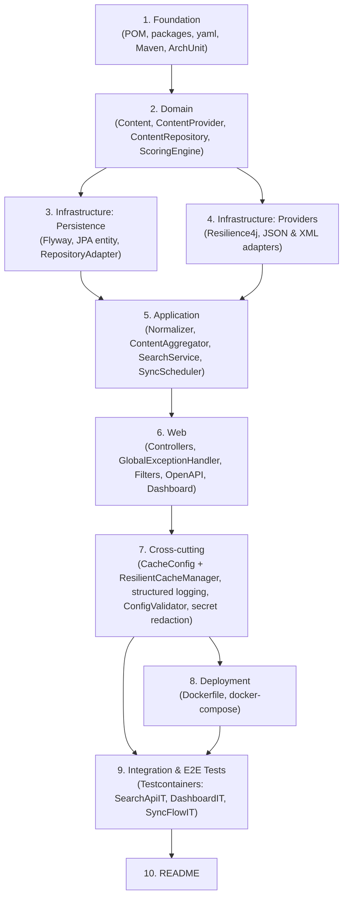

# Implementation Plan: Search Engine Aggregator Service

## Overview

This plan turns the existing `requirements.md` and `design.md` into an ordered, coding-only task list. Implementation is **Java 21 / Spring Boot 3.4+** following Clean Architecture (`domain` → `application` → `infrastructure`/`web`). Each step builds on the previous: foundation hardens the build, domain establishes pure-Java contracts, infrastructure plugs adapters into the ports, application orchestrates use-cases, web exposes HTTP, cross-cutting concerns wire caching/logging/config validation, deployment containerizes the stack, and finally integration tests pin behavior end-to-end.

Test sub-tasks are postfixed with `*` per the workflow convention. They are highly recommended (REQ 23 mandates test coverage and ArchUnit enforcement) but can be skipped for an MVP slice. Property tests use **jqwik** at ≥ 100 iterations and are tagged `Feature: search-engine-service, Property N: <name>` exactly as quoted from `design.md` § Correctness Properties.

---

## Tasks

- [x] 1. Project foundation, build, and architectural guardrails
  - [x] 1.1 Upgrade `pom.xml` to Spring Boot 3.4+ on Java 21 with all required dependencies
    - Replace the current `4.0.6` parent with `spring-boot-starter-parent:3.4.x`; set `<java.version>21</java.version>`.
    - Add starters and libraries cited in `design.md` § Testing Strategy → Maven configuration: `spring-boot-starter-web`, `-data-jpa`, `-data-redis`, `-cache`, `-thymeleaf`, `-validation`, `-actuator`, `springdoc-openapi-starter-webmvc-ui`, `flyway-core` + `flyway-database-postgresql`, `postgresql`, `resilience4j-spring-boot3`, `bucket4j_jdk17-core` (+ `bucket4j-redis`), `logstash-logback-encoder`. Test scope: `spring-boot-starter-test`, `testcontainers:postgresql`, `testcontainers:junit-jupiter`, `jqwik`, `archunit-junit5`. Replace the bogus `spring-boot-starter-webmvc(-test)` artifact ids with the correct `spring-boot-starter-web(-test)`.
    - _Requirements: 17.1, 18.1, 22.1, 23.5_

  - [x] 1.2 Create the Clean Architecture package skeleton
    - Create empty packages `com.example.searchengine.{domain.content, domain.provider, domain.scoring, application.search, application.ingest, application.scheduler, infrastructure.persistence, infrastructure.persistence.db.migration, infrastructure.provider.jsonprovider, infrastructure.provider.xmlprovider, infrastructure.cache, infrastructure.ratelimit, infrastructure.logging, infrastructure.config, web.api, web.dashboard, web.error, web.openapi}` matching `design.md` § Architecture → Package Layout, with `package-info.java` placeholders so empty packages compile.
    - Keep `SearchengineApplication.java` as the single `@SpringBootApplication` entry point.
    - _Requirements: 22.1, 22.2, 22.3, 22.4_

  - [x] 1.3 Author the `application.yaml` schema with environment-variable overrides
    - Populate `src/main/resources/application.yaml` exactly as specified in `design.md` § Configuration → `application.yaml` Schema (datasource, redis, providers, aggregator, cache, ratelimit blocks) using `${ENV:default}` placeholders for every operator-tunable value. Add an `application-local.yaml` profile fragment for developer defaults.
    - Document that environment variables take precedence; commit no real secrets or provider URLs (REQ 18.2).
    - _Requirements: 17.4, 18.1, 18.2_

  - [x] 1.4 Wire Maven Surefire and Failsafe so `mvn verify` runs unit + property + integration tests
    - Add `maven-failsafe-plugin` bound to `verify` with includes `**/*IT.java`, configure `maven-surefire-plugin` to include `**/*Test.java` and `**/*PropertyTest.java`, and ensure `<failOnError>true</failOnError>` so any test failure exits non-zero.
    - Confirm `mvn -B verify` runs in CI mode without interactive prompts.
    - _Requirements: 23.5_

  - [x] 1.5 Write ArchUnit tests enforcing layering and domain purity
    - Add `architecture/CleanArchitectureTest.java`, `DomainPurityTest.java`, `ContentRepositoryLocationTest.java` mirroring the rules in `design.md` § Architecture tests: layered access (`web` ⇏ `infrastructure`), `..domain.scoring..` may not depend on `org.springframework..`, `jakarta.persistence..`, `com.fasterxml.jackson..`, `jakarta.xml..`; `ContentRepository` interface lives in `..domain.content..`; controllers do not return `Content` directly.
    - Run as plain `*Test.java` so the rules fire under Surefire from the very first commit.
    - _Requirements: 6.1, 22.1, 22.2, 22.3, 22.4, 22.5_

- [x] 2. Domain layer (pure Java, no framework imports)
  - [x] 2.1 Implement `Content` record and `ContentType` enum
    - Create `domain/content/Content.java` (compact constructor enforcing non-blank `provider`/`externalId`/`title`, non-null `type`/`publishedAt`, non-negative metrics, immutable `tags`) and `domain/content/ContentType.java` with `fromProviderValue` mapping `article` → `TEXT`.
    - Add `ProviderName` value object if it adds clarity; otherwise rely on `String provider`.
    - _Requirements: 3.3, 3.4, 4.1, 4.2, 4.3, 4.4, 4.5, 22.2_

  - [x] 2.2 Define the `ContentProvider` port and supporting types
    - Create `domain/provider/ContentProvider.java` with `String name()` and `List<RawContent> fetch()` (no checked exceptions); add `domain/provider/RawContent.java` (provider-agnostic raw payload covering the union of JSON and XML mapped fields per REQ 2.3 / REQ 3.2) and `ProviderFetchResult` if a structured outcome is needed.
    - _Requirements: 1.1, 2.3, 3.2, 22.2_

  - [x] 2.3 Define the `ContentRepository` port and search value objects
    - Create `domain/content/ContentRepository.java` with `upsert(Content)` returning `UpsertOutcome { INSERTED, UPDATED }`, `search(SearchCriteria)` returning `SearchPage { List<Content> items, long total }`, and `findById(UUID)`.
    - Add `domain/content/SearchCriteria.java` (`q`, `ContentType type`, `SortField sort`, `int page`, `int limit`) and `domain/content/SortField.java` (`SCORE`, `POPULARITY`, `RELEVANCE`) with `parse(String)` that maps `null`/blank to `SCORE` (REQ 9.6).
    - _Requirements: 5.1, 5.2, 9.1, 9.3, 9.4, 9.5, 9.6, 22.3_

  - [x] 2.4 Implement `ScoringEngine` and four sub-calculators as pure Java
    - Create `domain/scoring/ScoringEngine.java`, `DefaultScoringEngine.java`, `BaseScoreCalculator.java`, `TypeMultiplier.java`, `EngagementScoreCalculator.java`, `FreshnessScoreCalculator.java`, `ScoreBreakdown.java`. `score(Content, Instant)` composes `(base × multiplier) + freshness + engagement` exactly as `design.md` § Scoring Engine Design specifies, guarding division-by-zero (engagement = 0 when `views == 0` for video or `readingTime == 0` for text), and recomputing freshness on every call.
    - Forbid any `org.springframework`, `jakarta.persistence`, `com.fasterxml.jackson` import; `evaluationAt` is always an explicit parameter.
    - _Requirements: 6.1, 6.2, 6.3, 6.4, 6.5, 6.6, 6.7, 6.8, 6.9, 6.10, 6.11, 7.1, 7.2, 7.3, 7.4, 7.5, 22.2_

  - [x] 2.5 Write JUnit 5 example unit tests for `Content` invariants and `ContentType.fromProviderValue`
    - Cover compact-constructor rejections (blank title, negative views, null `publishedAt`) and the `article → TEXT` / `video → VIDEO` mappings; assert unknown raw types throw `IllegalArgumentException`.
    - _Requirements: 3.3, 3.4, 4.3, 4.4, 4.5_

  - [x] 2.6 Write JUnit 5 example unit tests for `DefaultScoringEngine`
    - Reproduce both worked examples from `instructions.md` § 47 / `design.md` § Testing Strategy: video case (views=15000, likes=1200, 3 days old → final≈46.3) and text case (final≈303.25). Assert each `ScoreBreakdown` component within `1e-4` (REQ 23.1).
    - _Requirements: 6.2, 6.3, 6.4, 6.5, 6.6, 6.7, 6.8, 6.9, 7.1, 7.2, 7.3, 7.4, 23.1_

  - [x] 2.7 Write a jqwik property test for the scoring formula
    - File: `domain/scoring/ScoringEnginePropertyTest.java`. Generator yields valid `Content` snapshots with non-negative metrics and arbitrary `Instant` evaluation timestamps; assert each component (`baseScore`, `typeMultiplier`, `engagementScore`, `freshnessScore`) and the sum within `1e-9`.
    - Property: `Feature: search-engine-service, Property 3: Scoring formula correctness`
    - For any `Content` snapshot with non-negative metrics and any `Instant` evaluation timestamp, `DefaultScoringEngine.score(content, evaluationAt)` returns a `ScoreBreakdown` such that: `baseScore` equals `views/1000.0 + likes/100.0` for VIDEO and `readingTime + reactions/50.0` for TEXT; `typeMultiplier` equals 1.5 for VIDEO and 1.0 for TEXT; `engagementScore` equals `(likes/views)*10` for VIDEO with `views > 0`, `(reactions/readingTime)*5` for TEXT with `readingTime > 0`, and `0` otherwise; `freshnessScore` equals 5 / 3 / 1 / 0 for ages ≤ 7, ≤ 30, ≤ 90, > 90 days respectively; `finalScore` equals `(baseScore * typeMultiplier) + freshnessScore + engagementScore`, with each component satisfying the equality within an absolute tolerance of `1e-9`.
    - Iterations: 200
    - _Requirements: 6.2, 6.3, 6.4, 6.5, 6.6, 6.7, 6.8, 6.9, 6.11, 7.1, 7.2, 7.3, 7.4_

  - [x] 2.8 Write a jqwik property test for scoring determinism
    - Same generator as 2.7; call `score(c, t)` twice and assert bit-for-bit equal `finalScore`. Reflection check: `Content` exposes no `freshnessScore` field.
    - Property: `Feature: search-engine-service, Property 4: Scoring determinism`
    - For any `Content` snapshot `c` and any `Instant` `t`, two invocations of `DefaultScoringEngine.score(c, t)` return identical `ScoreBreakdown` values (bit-for-bit equal `finalScore`), and `Content` carries no field for `freshnessScore` (freshness is recomputed every call).
    - Iterations: 100
    - _Requirements: 6.10, 6.11, 7.5_

- [x] 3. Infrastructure: persistence (Flyway, JPA, port adapter)
  - [x] 3.1 Author the Flyway `V1__init.sql` migration
    - Path: `src/main/resources/db/migration/V1__init.sql`. Contains the `contents` table, the `(provider, external_id)` UNIQUE constraint, indexes on `type` and `final_score DESC`, and the GIN index on `to_tsvector('simple', title || ' ' || coalesce(description, ''))`, exactly as in `design.md` § Database Schema.
    - Set `spring.jpa.hibernate.ddl-auto=validate` and `spring.flyway.enabled=true` in `application.yaml`.
    - _Requirements: 5.1, 5.4, 5.5_

  - [x] 3.2 Implement `ContentEntity` JPA model
    - File: `infrastructure/persistence/ContentEntity.java`. `@Entity @Table(name="contents")` with column mappings for every domain field, `tags` as `String[]`, `@Version` for optimistic locking, `@CreationTimestamp` / `@UpdateTimestamp`. Keep this class out of `domain` — it is purely infrastructure.
    - _Requirements: 5.1, 5.2, 5.3, 22.2, 22.3_

  - [x] 3.3 Implement `ContentJpaRepository` with native upsert and FTS search queries
    - File: `infrastructure/persistence/ContentJpaRepository.java` extending `JpaRepository<ContentEntity, UUID>`. Add the native `INSERT ... ON CONFLICT (provider, external_id) DO UPDATE ... RETURNING (xmax = 0) AS inserted` upsert (REQ 5.2, 5.7) and the parameterized FTS query using `plainto_tsquery('simple', :q)` with the deterministic `id ASC` tie-break and `LIMIT/OFFSET` exactly as in `design.md` § Persistence Layer.
    - _Requirements: 5.1, 5.2, 5.5, 5.7, 8.2, 8.5, 9.1, 9.3, 9.4, 9.5, 9.6, 19.3, 20.3_

  - [x] 3.4 Implement `ContentRepositoryAdapter` (port impl) with mapping and exception translation
    - File: `infrastructure/persistence/ContentRepositoryAdapter.java` implementing `domain.content.ContentRepository`. Maps domain `Content` ↔ `ContentEntity` (no Lombok required; static helper methods). Translates `DataAccessException` into a domain `ContentRepositoryException` (created in `domain/content/`) so REQ 14.3 can surface 503 responses.
    - _Requirements: 5.1, 5.2, 5.6, 5.7, 14.3, 22.3_

  - [x] 3.5 Write JUnit 5 unit tests for the entity↔domain mapper
    - Round-trip `Content → ContentEntity → Content` and assert field-level equality including `tags` ordering and `null` description handling.
    - _Requirements: 4.1, 5.1, 5.2_

  - [x] 3.6 Write a Testcontainers integration property test for repository upsert idempotence
    - File: `infrastructure/persistence/ContentRepositoryUpsertIT.java`. Boots `PostgreSQLContainer<>("postgres:16")`, applies Flyway, then drives the property: generate two `Content` snapshots `A`, `B` sharing `(provider, externalId)`; assert `upsert(A); upsert(B)` yields a single row equal to having only called `upsert(B)` and `count == 1`.
    - Property: `Feature: search-engine-service, Property 5: Repository upsert idempotence`
    - For any two `Content` snapshots `A` and `B` that share the same `(provider, externalId)`, calling `repository.upsert(A)` then `repository.upsert(B)` leaves the database in a state equal to having called `repository.upsert(B)` once on an empty store, and the row count for that `(provider, externalId)` is exactly 1.
    - Iterations: 100
    - _Requirements: 5.1, 5.2, 23.3_

- [x] 4. Infrastructure: provider adapters (Strategy Pattern)
  - [x] 4.1 Configure shared HTTP client with timeouts and Resilience4j
    - File: `infrastructure/provider/HttpClientConfig.java`. Two `RestClient` beans (one per provider) with 5 s connect / 10 s read timeouts (REQ 2.1). Configure Resilience4j `TimeLimiter` (10 s, REQ 21.1), `Retry` (max 3 attempts, exp backoff 500 ms × 2, REQ 21.2) per provider name. Bind to `ProviderProperties`.
    - _Requirements: 2.1, 21.1, 21.2_

  - [x] 4.2 Implement the JSON provider adapter, client, DTOs, and mapper
    - Files under `infrastructure/provider/jsonprovider/`: `JsonProviderClient.java` (uses the JSON `RestClient`), `JsonProviderResponse.java` + `JsonContentDto.java` + `JsonMetrics.java` (Jackson records), `JsonContentMapper.java` (DTO → `RawContent` with the mappings from REQ 2.3), `JsonProviderAdapter.java` (`@Component` implementing `ContentProvider`, suppressing transport/parse failures with `[]` per REQ 2.4 / 2.6 and per-item failure isolation per REQ 2.5).
    - `name()` returns `"provider1-json"` (or configurable from `ProviderProperties`).
    - _Requirements: 1.2, 1.4, 2.1, 2.2, 2.3, 2.4, 2.5, 2.6, 5.6, 16.4_

  - [x] 4.3 Implement the XML provider adapter, client, DTOs, and mapper
    - Files under `infrastructure/provider/xmlprovider/`: `XmlProviderClient.java`, `XmlFeedDto.java` + `XmlItemDto.java` + `XmlStatsDto.java` (JAXB), `XmlContentMapper.java` (DTO → `RawContent` applying the field mapping in REQ 3.2 and `article → TEXT` via `ContentType.fromProviderValue`), `XmlProviderAdapter.java` (`@Component` implementing `ContentProvider`, returning `[]` on malformed XML per REQ 3.6, defaulting absent optional elements per REQ 3.5).
    - `name()` returns `"provider2-xml"`.
    - _Requirements: 1.2, 1.4, 3.1, 3.2, 3.3, 3.4, 3.5, 3.6, 5.6, 16.4_

  - [x] 4.4 Write JUnit 5 unit tests for both provider adapters (happy path + per-item failure)
    - For each adapter, mock the HTTP client with WireMock or Spring's `MockRestServiceServer`. Cases: (a) successful payload mapped field-for-field, (b) one item missing a required field is dropped while siblings persist (REQ 2.5 / 3.5), (c) malformed payload returns `[]` (REQ 2.6 / 3.6), (d) HTTP 5xx returns `[]` after retries.
    - _Requirements: 2.4, 2.5, 2.6, 3.5, 3.6, 23.2_

  - [x] 4.5 Write a jqwik round-trip property test for both providers
    - Files: `infrastructure/provider/jsonprovider/JsonProviderRoundTripPropertyTest.java`, `infrastructure/provider/xmlprovider/XmlProviderRoundTripPropertyTest.java`. Generators (`@Provide`) emit DTO instances covering every documented field including optional XML elements absent and `type=article`. Assert serialize → deserialize equality and that the mapper output matches the documented per-provider mapping including `article → text`.
    - Property: `Feature: search-engine-service, Property 1: Provider round-trip equivalence`
    - For any generated provider payload (JSON or XML) conforming to the documented schema, parsing the serialized payload into the provider DTO and then re-serializing the DTO produces a payload whose value for every documented field is equal to the corresponding value in the original payload, and the mapper applied to the parsed DTO produces a `RawContent` whose fields match the documented per-provider mapping (including the `article → text` rewrite for the XML provider).
    - Iterations: 100
    - _Requirements: 2.2, 2.3, 3.1, 3.2, 3.3, 3.4, 3.5, 4.1, 23.4_

  - [x] 4.6 Write a jqwik property test for provider transport robustness
    - File: `infrastructure/provider/ProviderTransportPropertyTest.java`. Use WireMock to parameterize `(failureCount, latencyMs)`; assert the three branches of the property below.
    - Property: `Feature: search-engine-service, Property 11: Provider transport robustness (timeout and retry)`
    - For any upstream provider whose HTTP behavior is parameterized by `(failureCount, latencyMs)`: (a) if `latencyMs > 10000`, the adapter aborts within 10500 ms and returns `[]`; (b) if `failureCount ≤ 2` (i.e., succeeds within the retry budget), the adapter returns a non-empty list with delay between calls following exponential backoff starting at 500 ms; (c) if `failureCount ≥ 3` (all retries fail), the adapter returns `[]` and does not throw.
    - Iterations: 100
    - _Requirements: 21.1, 21.2, 21.3_

- [x] 5. Application layer (use-cases and orchestration)
  - [x] 5.1 Implement `Normalizer`, `NormalizationResult` sealed type, and Cc-control sanitization
    - Files under `application/ingest/`: `Normalizer.java` interface + `DefaultNormalizer.java` impl, `NormalizationResult.java` sealed type with `Accepted(Content)` and `Rejected(String field, String reason)`. Sanitization strips Unicode `Cc` codepoints except `\t`/`\n`/`\r` from `title` and `description`. Validation enforces non-blank `title`/`externalId`, valid `type`, non-null `publishedAt`, non-negative metrics; failures produce `Rejected` rather than throwing.
    - _Requirements: 4.1, 4.2, 4.3, 4.4, 4.5, 16.4, 19.4_

  - [x] 5.2 Implement `ContentAggregator` (sync orchestrator with failure isolation)
    - File: `application/ingest/ContentAggregator.java`. Injects `List<ContentProvider>`, `Normalizer`, `ScoringEngine`, `ContentRepository`, `Clock`. `runSync()` iterates providers in a try/catch (REQ 11.3), normalizes each `RawContent`, scores the accepted ones, upserts them, and logs `provider`/`externalId`/`outcome` plus elapsed milliseconds per fetch. Annotated with `@CacheEvict(cacheNames = "search", allEntries = true)` so cache invalidation is part of the unit of work (REQ 11.4 / 12.4).
    - _Requirements: 1.3, 4.3, 5.6, 5.7, 11.2, 11.3, 11.4, 12.4, 16.3, 16.4_

  - [x] 5.3 Implement `SearchService` with `@Cacheable` and `SearchCacheKeyGenerator`
    - Files under `application/search/`: `SearchService.java` interface, `DefaultSearchService.java` impl annotated `@Cacheable(cacheNames="search", keyGenerator="searchCacheKeyGenerator", unless="#result == null")`. `SearchQuery.java` (input record), `SearchResult.java` (output record). Add `SearchCacheKeyGenerator` (in `infrastructure/cache/`) that emits a stable string from `(q, type, sort, page, limit)` with `_NONE_` for nulls.
    - _Requirements: 8.2, 8.5, 9.1, 9.3, 9.4, 9.5, 9.6, 9.7, 9.8, 9.10, 9.11, 12.1, 12.6, 20.3_

  - [x] 5.4 Implement `SyncScheduler`
    - File: `application/scheduler/SyncScheduler.java`. `@Component @ConditionalOnProperty("aggregator.sync.enabled", matchIfMissing=true)` (REQ 11.5). `@Scheduled(fixedDelayString = "${aggregator.sync.fixed-delay-ms:300000}")`. Uses `AtomicBoolean` to skip overlapping runs and logs the skip reason. Enable scheduling via `@EnableScheduling` on a `@Configuration` class.
    - _Requirements: 11.1, 11.2, 11.5_

  - [x] 5.5 Write JUnit 5 unit tests for `Normalizer` (REQ 23.2)
    - One success case per provider with every documented field populated; one dedicated test per invalid case (blank `title`, unknown `type`, invalid `publishedAt`, missing `externalId`, negative `views`/`likes`/`reactions`/`readingTime`) asserting `Rejected(field, ...)` is returned with the offending field name.
    - _Requirements: 4.1, 4.3, 4.4, 4.5, 23.2_

  - [x] 5.6 Write JUnit 5 unit tests for `ContentAggregator` orchestration
    - With Mockito stubs, verify: (a) one provider throwing does not abort others, (b) repository exception on one item does not abort the batch, (c) cache eviction is invoked exactly once after a successful run, (d) per-fetch info log includes elapsed milliseconds.
    - _Requirements: 5.6, 5.7, 11.3, 11.4, 12.4, 16.3_

  - [x] 5.7 Write a jqwik property test for per-item and per-provider failure isolation
    - File: `application/ingest/ContentAggregatorPropertyTest.java`. Generator yields `(N providers × M items)` matrices flagging each provider as "throws on fetch" and each item as "parse-fail | db-fail | valid". Drive `runSync()` on stubs and assert every valid item from every non-throwing provider is upserted, no exception escapes the aggregator.
    - Property: `Feature: search-engine-service, Property 2: Per-item and per-provider failure isolation`
    - For any sync batch containing a random mix of valid items, parse-failing items, DB-failing items, and a random subset of providers throwing during `fetch()`, every valid item from every non-throwing provider is normalized, scored, and successfully upserted, and no exception escapes the `Content_Aggregator`.
    - Iterations: 100
    - _Requirements: 2.4, 2.5, 2.6, 3.6, 5.6, 11.3_

  - [x] 5.8 Write a jqwik property test for sanitization
    - File: `application/ingest/NormalizerSanitizationPropertyTest.java`. Generator emits arbitrary Unicode strings; assert no `Cc` codepoint other than `0x09 / 0x0A / 0x0D` appears in the output, and that every other codepoint from the input is preserved in order.
    - Property: `Feature: search-engine-service, Property 7: Title and description sanitization`
    - For any input string `s`, the result of `Normalizer.sanitize(s)` contains no Unicode `Cc` codepoints other than `0x09` (tab), `0x0A` (newline), and `0x0D` (carriage return), and every other codepoint from `s` appears in the output in the same order with the same value.
    - Iterations: 200
    - _Requirements: 19.4_

  - [x] 5.9 Write a jqwik property test for cache semantics
    - File: `application/search/SearchServiceCachePropertyTest.java`. Generator yields random sequences of `(SearchQuery, syncEvent?)`. Drive `SearchService` with a Mockito-spied repository and assert: (a) repeat queries hit cache, (b) post-sync eviction clears entries, (c) `cache.search.enabled=false` always invokes the repository, (d) thrown exceptions and Redis-down conditions never persist a cache entry.
    - Property: `Feature: search-engine-service, Property 9: Cache semantics`
    - For any sequence of `Search_Service` invocations with cache enabled, (a) two consecutive calls with the same `(q, type, sort, page, limit)` 5-tuple produce identical results and the second invocation does not call the `Content_Repository`; (b) after a successful `Content_Aggregator` sync run, every previously cached `search` entry is absent on the next read; (c) when `cache.search.enabled=false`, every call invokes the repository regardless of repetition; (d) when the underlying call throws or the cache backend is unavailable, no entry is written.
    - Iterations: 100
    - _Requirements: 11.4, 12.1, 12.3, 12.4, 12.5, 12.6, 12.7_

- [x] 6. Web layer (controllers, filters, exception handler, OpenAPI, dashboard)
  - [x] 6.1 Implement `SearchController` with Bean Validation DTOs
    - Files under `web/api/`: `SearchController.java` (`@RestController @RequestMapping("/api/v1") GET /search`), `SearchRequest.java` (record with `@NotBlank @Size(min=1,max=200) String q`, `@Pattern("^(video|text)$") String type`, `@Pattern("^(score|popularity|relevance)$") String sort`, `@Min(1) Integer page`, `@Min(1) @Max(100) Integer limit`), `SearchResponse.java`, `ContentSummaryDto.java`, `PaginationDto.java`. `SearchRequest.toQuery()` applies defaults `page=1`, `limit=10`, `sort=SCORE` (REQ 9.6, 9.7, 9.8).
    - _Requirements: 8.1, 8.3, 8.4, 9.1, 9.2, 9.7, 9.8, 9.9, 9.10, 9.11, 19.1, 19.2, 22.4, 22.5_

  - [x] 6.2 Implement `GlobalExceptionHandler` with the standardized error envelope
    - Files under `web/error/`: `GlobalExceptionHandler.java` (`@ControllerAdvice`), `ErrorResponse.java`, `ErrorMessageSanitizer.java`. Map exceptions to HTTP statuses per the table in `design.md` § Global Exception Handling: 400/`INVALID_QUERY`, 413/`PAYLOAD_TOO_LARGE`, 503/`DATABASE_UNAVAILABLE`, 502/`PROVIDER_ERROR`, 500/`INTERNAL_ERROR`. The validation handler is `@Order(HIGHEST_PRECEDENCE)`; the `Throwable` catch-all logs the full stack trace and emits a generic `"Internal server error"` message; sanitizer strips configured secret values from emitted messages (REQ 18.5).
    - _Requirements: 14.1, 14.2, 14.3, 14.4, 14.5, 18.5, 19.5, 21.4_

  - [x] 6.3 Implement `RequestIdFilter` for MDC propagation
    - File: `infrastructure/logging/RequestIdFilter.java` (`OncePerRequestFilter`, registered with the highest order). Reads `X-Request-Id` header or generates a UUID, puts it into SLF4J MDC under `requestId`, mirrors it back in the response header, and clears MDC in a `finally` block. Register via `FilterRegistrationBean`.
    - _Requirements: 16.1, 16.2_

  - [x] 6.4 Implement `RateLimitFilter` (Bucket4j) plus the "disabled but tracking" variant
    - Files under `infrastructure/ratelimit/`: `RateLimitFilter.java` (`@ConditionalOnProperty("ratelimit.enabled", matchIfMissing=true)`), `LoggingOnlyRateLimitFilter.java` (loaded when `ratelimit.enabled=false`), `ClientIpResolver.java` (X-Forwarded-For aware), `RateLimitProperties.java`. Buckets are sized from `requests-per-window` over `window-seconds`; reject responses are 429 with `Retry-After` and the standard error envelope `{"error":{"code":"RATE_LIMITED",...}}`.
    - _Requirements: 13.1, 13.2, 13.3, 13.4, 13.5, 14.1_

  - [x] 6.5 Implement `OpenApiConfig` with three Search API examples
    - File: `web/openapi/OpenApiConfig.java`. `@Bean OpenAPI` with metadata. On `SearchController.search`, register three `@ExampleObject` instances illustrating distinct behaviours: `keyword-only` (default sort/page/limit), `type-filtered` (`type=text`), `paginated` (`page=3, limit=25`). Reference the `ErrorResponse` schema for 400 responses, matching `GlobalExceptionHandler` exactly.
    - _Requirements: 15.1, 15.2, 15.3, 15.4_

  - [x] 6.6 Implement `DashboardController` and the Thymeleaf template
    - Files: `web/dashboard/DashboardController.java`, `src/main/resources/templates/dashboard.html`. Tolerant parsing of `sort` and `type` (invalid values fall back to defaults and surface a visible "ignored" notice — REQ 10.5, 10.7). Default page renders top 20 by `final_score DESC` with `id ASC` tie-break; renders exactly the columns `Title | Type | Score`; shows an empty-state message when no rows match. Reuses `SearchService` so query semantics match the API.
    - _Requirements: 10.1, 10.2, 10.3, 10.4, 10.5, 10.6, 10.7, 10.8_

  - [x] 6.7 Write JUnit 5 unit tests for `GlobalExceptionHandler`
    - One test per row in the mapping table: validation, 413, repository exception (503), provider exception (502), generic Throwable (500). Assert HTTP status, `error.code`, and that the generic 500 response message is the literal `"Internal server error"`.
    - _Requirements: 14.1, 14.2, 14.3, 14.4, 14.5, 19.5_

  - [x] 6.8 Write JUnit 5 unit tests for `DashboardController` tolerance
    - Cover invalid `sort`/`type` values produce default ordering plus the ignored-notice banner; empty result set renders the empty-state message.
    - _Requirements: 10.5, 10.7, 10.8_

  - [x] 6.9 Write a jqwik property test for the input-validation pipeline
    - File: `web/api/SearchControllerValidationPropertyTest.java`. Drive `MockMvc` with random query parameter strings; assert `SearchService` is invoked iff every constraint passes, otherwise the response is 400 with `{"error":{"code":"INVALID_QUERY","message":<string>}}` naming the first offending field.
    - Property: `Feature: search-engine-service, Property 6: Input validation pipeline`
    - For any HTTP request to `/api/v1/search` with random query parameters, the `Search_Service` is invoked if and only if every constraint declared in Requirements 8 and 9 passes; otherwise the response status is 400, the body matches `{"error":{"code":"INVALID_QUERY","message":<string>}}`, and the message identifies the first offending field together with the constraint it violated.
    - Iterations: 200
    - _Requirements: 4.3, 4.4, 4.5, 8.3, 8.4, 9.2, 9.7, 9.8, 9.9, 14.1, 14.2, 19.1, 19.2_

  - [x] 6.10 Write a jqwik property test for rate-limit transition correctness
    - File: `infrastructure/ratelimit/RateLimitTransitionPropertyTest.java`. Drive `MockMvc` with `N` requests per IP within one window; assert the first `requests-per-window` succeed and every subsequent one returns 429 with a numeric `Retry-After` in `[1, window-seconds]`.
    - Property: `Feature: search-engine-service, Property 10: Rate-limit transition correctness`
    - For any client IP and any monotonically increasing sequence of `N` requests issued within a single `window-seconds` window, the first `requests-per-window` requests receive HTTP responses other than 429, every request beyond the limit receives HTTP 429 with a `Retry-After` header whose integer value is ≥ 1 and ≤ `window-seconds`, and the body matches the standard error envelope.
    - Iterations: 100
    - _Requirements: 13.2, 13.3, 14.1_

  - [x] 6.11 Write a jqwik property test for `requestId` MDC propagation
    - File: `infrastructure/logging/RequestIdMdcPropertyTest.java`. Capture log events via Logback's `ListAppender`; for each request assert the MDC `requestId` is non-null, non-empty, and unique across requests in the run.
    - Property: `Feature: search-engine-service, Property 12: Request-id MDC propagation`
    - For any sequence of `N` HTTP requests handled by `Search_API`, every JSON log entry emitted within a request's processing window carries a non-null, non-empty `requestId` in its MDC field, and `requestId` values across distinct requests are pairwise unique.
    - Iterations: 100
    - _Requirements: 16.1, 16.2_

  - [x] 6.12 Write a jqwik property test for the request size limit
    - File: `web/api/RequestSizeLimitPropertyTest.java`. Generate random `(body_bytes, query_string_bytes)` totals; assert 413 is returned iff total ≥ 8193 and `SearchService` is never invoked when 413 is returned.
    - Property: `Feature: search-engine-service, Property 15: Request body / query size limit`
    - For any total request size `N` measured as `body_bytes + query_string_bytes`, the response status is 413 if and only if `N ≥ 8193`, and when 413 is returned the `Search_Service` is not invoked.
    - Iterations: 200
    - _Requirements: 19.5_

- [x] 7. Cross-cutting concerns (caching, logging, configuration validation, secret redaction)
  - [x] 7.1 Implement `CacheConfig` with `RedisCacheManager` and `ResilientCacheManager` fallback
    - Files under `infrastructure/cache/`: `CacheConfig.java` (`@EnableCaching`, conditional on `cache.search.enabled`, builds `RedisCacheManager` with TTL bound to `cache.search.ttl-seconds`), `ResilientCacheManager.java` (delegates to a wrapped `CacheManager`, catches `RedisConnectionFailureException` on read/write, logs WARN, returns `null` on read-fail and silently no-ops on write-fail so the service falls through to the repository — REQ 12.7).
    - When `cache.search.enabled=false`, expose a `NoOpCacheManager` so `@Cacheable` becomes a no-op.
    - _Requirements: 12.1, 12.2, 12.3, 12.5, 12.7, 17.3_

  - [x] 7.2 Configure structured JSON logging via `logstash-logback-encoder`
    - File: `src/main/resources/logback-spring.xml` per `design.md` § Logging — `LogstashEncoder` with `<includeMdcKeyName>requestId</includeMdcKeyName>`. Verify `provider`, `externalId`, `field`, `elapsedMs`, `outcome` fields are emitted as JSON keys via `kv()` helpers in error/info logs.
    - _Requirements: 16.1, 16.3, 16.4_

  - [x] 7.3 Implement `@ConfigurationProperties` classes and `ConfigValidator`
    - Files under `infrastructure/config/`: `ProviderProperties.java`, `AggregatorProperties.java`, `CacheProperties.java`, `RateLimitProperties.java` — each typed and Bean-Validation-annotated (`@NotBlank`, `@Min`, `@Max`). `ConfigValidator implements ApplicationListener<ApplicationStartingEvent>` enumerates required keys (DB URL/user/password, JSON & XML provider URLs), logs ERROR for each missing one, and calls `SpringApplication.exit(ctx, () -> 1)` within 10 seconds without initializing any HTTP/DB/scheduler bean.
    - _Requirements: 18.1, 18.2, 18.3, 18.4_

  - [x] 7.4 Implement secret redaction (`SecretRedactingPropertySource` + `ErrorMessageSanitizer` integration)
    - File: `infrastructure/config/SecretRedactingPropertySource.java` — wraps the resolved `Environment` so that any code calling `env.getProperty("spring.datasource.password")` for log output (e.g., a startup banner) receives `***REDACTED***`. Wire `ErrorMessageSanitizer` (from task 6.2) with the same secret-key list so user-facing error bodies never leak secrets.
    - _Requirements: 18.5_

  - [x] 7.5 Write a jqwik property test for required-configuration validation
    - File: `infrastructure/config/RequiredConfigPropertyTest.java`. For each non-empty subset of `{DB_URL, DB_USERNAME, DB_PASSWORD, PROVIDER_JSON_URL, PROVIDER_XML_URL}`, launch a Spring context with those keys cleared; assert exit within 10 s, non-zero exit code, ERROR log naming each cleared key, and that no HTTP listener is bound.
    - Property: `Feature: search-engine-service, Property 13: Required configuration validation`
    - For any non-empty subset `S` of the documented required configuration keys (DB URL/user/password, JSON provider URL, XML provider URL), starting the application with every key in `S` cleared causes startup termination within 10 seconds with a non-zero exit code, an ERROR log entry naming each cleared key, and no HTTP listener bound.
    - Iterations: 100
    - _Requirements: 18.3, 18.4_

  - [x] 7.6 Write a jqwik property test for secret redaction
    - File: `infrastructure/config/SecretRedactionPropertyTest.java`. Generator emits random secret values; configure them as `spring.datasource.password`, provider API keys, etc., emit log lines that include those values via the wrapped `Environment` and via `ErrorMessageSanitizer`, then exhaustively scan captured logs for the original secret value (must not appear) and for the literal `***REDACTED***` (must appear).
    - Property: `Feature: search-engine-service, Property 14: Secret redaction`
    - For any log invocation whose log message or argument is the value of a secret-keyed configuration property (DB password, provider API key, authentication token), the rendered log output contains the literal redaction marker `***REDACTED***` instead of the original secret value, and an exhaustive scan of captured logs across a synthetic test run never contains the original secret value.
    - Iterations: 100
    - _Requirements: 18.5_

- [x] 8. Containerized deployment
  - [x] 8.1 Author the multi-stage `Dockerfile`
    - Two stages: `maven:3.9-eclipse-temurin-21 AS build` (runs `mvn -B -ntp -q -DskipTests package` after a `dependency:go-offline` warm-up) and `eclipse-temurin:21-jre` runtime. `EXPOSE 8080`, `HEALTHCHECK` against `/actuator/health`, `ENTRYPOINT ["java","-jar","/app/app.jar"]`. File at repo root.
    - _Requirements: 17.1, 17.4_

  - [x] 8.2 Author `docker-compose.yml` for `app`, `postgres`, `redis`
    - `app` service builds from the local `Dockerfile`, exposes `${SERVER_PORT:-8080}`, depends on `postgres` and `redis` with `condition: service_healthy`. `postgres:16` and `redis:7-alpine` both ship healthchecks (`pg_isready`, `redis-cli ping`) per `design.md` § Docker. All secrets and provider URLs are sourced from environment variables and never committed.
    - _Requirements: 17.1, 17.2, 17.3, 17.4, 18.2_

- [x] 9. Integration and end-to-end tests (Testcontainers)
  - [x] 9.1 Write `SearchApiIT` covering keyword, type-filtered, and paginated searches
    - File: `integration/SearchApiIT.java`. `@SpringBootTest(webEnvironment = MOCK) @Testcontainers` with `PostgreSQLContainer<>("postgres:16")`. Apply Flyway, seed a deterministic fixture, then drive `MockMvc` with the three required scenarios from REQ 23.3 and assert response status, ordering, and pagination metadata derived from the fixture.
    - _Requirements: 8.1, 8.2, 9.1, 9.7, 9.8, 9.10, 9.11, 23.3_

  - [x] 9.2 Write a jqwik property test for search result invariants over the fixture
    - File: `integration/SearchResultInvariantsPropertyTest.java`. Generator yields valid `SearchRequest` instances bounded to the fixture's vocabulary; assert (a) `type` filter respected, (b) result ordered non-increasing by chosen sort with `id ASC` tie-break, (c) `data.length ≤ limit`, (d) every item matches `q` under `plainto_tsquery('simple', q)`, (e) response shape carries non-negative integer `page`/`limit`/`total`.
    - Property: `Feature: search-engine-service, Property 8: Search result invariants`
    - For any valid `SearchRequest` against a deterministic seeded corpus, the response satisfies all of the following: (a) every item in `data` has `type` equal to the requested `type` filter when one is supplied; (b) `data` is non-increasing in the chosen sort key (`final_score`, `popularity_score`, or `ts_rank`) with deterministic tie-break by `id` ascending; (c) `data.length ≤ limit`; (d) every item's title or description matches the supplied `q` under PostgreSQL `plainto_tsquery('simple', q)`; (e) the response shape contains a `data` array and a `pagination` object with non-negative integer `page`, `limit`, and `total` fields.
    - Iterations: 100
    - _Requirements: 8.2, 8.5, 9.1, 9.3, 9.4, 9.5, 9.6, 9.10, 9.11, 10.3, 10.4, 10.6, 20.3_

  - [x] 9.3 Write `DashboardControllerIT`
    - File: `integration/DashboardControllerIT.java`. Boots the same Testcontainers context, drives `GET /dashboard` with default, `sort=popularity`, `type=video`, `type=garbage` (ignored notice), and an empty fixture (empty-state) and asserts the rendered HTML.
    - _Requirements: 10.1, 10.2, 10.3, 10.5, 10.6, 10.7, 10.8_

  - [x] 9.4 Write `SyncFlowIT` covering scheduler → aggregator → repository → cache eviction
    - File: `integration/SyncFlowIT.java`. With WireMock for the two providers and Testcontainers for Postgres and Redis, trigger `ContentAggregator.runSync()` and assert: rows are upserted, the `(provider, externalId)` constraint prevents duplicates on a second run, and a previously-cached `search` entry is absent within 5 s of completion.
    - _Requirements: 5.2, 5.7, 11.2, 11.4, 12.4, 23.3_

- [x] 10. README and operator documentation
  - [x] 10.1 Author `README.md` covering setup, environment variables, and architecture decisions
    - Sections: Quick start (`docker compose up`), required vs optional environment variables (table listing Spring property key, name, format, default), local Maven workflow (`mvn verify` runs unit + property + integration tests), architecture summary citing ADR-001 through ADR-011 from `design.md`, and a "How to add a new provider" walkthrough that follows the Strategy Pattern. Explicitly document that real secrets and provider URLs are never committed (REQ 18.2).
    - _Requirements: 17.1, 17.2, 17.4, 18.2, 18.3, 22.1_

---

## Notes

- Tasks marked with `*` are optional and can be skipped for a faster MVP slice; for a production cut every starred test task should be implemented because REQ 22 (ArchUnit) and REQ 23.1–23.5 explicitly mandate them.
- Each task references the granular requirement clauses it satisfies (e.g., `_Requirements: 6.2, 6.9_`).
- Property tests are tagged `Feature: search-engine-service, Property N: <name>` and quote the corresponding "*For any* …" statement verbatim from `design.md` § Correctness Properties; iteration budgets are stated per task.
- The Maven `verify` lifecycle (task 1.4) is the single execution gate — Surefire runs `*Test.java` and `*PropertyTest.java`, Failsafe runs `*IT.java`. Any failure exits non-zero (REQ 23.5).
- Implementation order assumes the Strategy Pattern: provider adapters can be added without editing `ContentAggregator` once tasks 4.1–4.3 are in place. ArchUnit (task 1.5) catches accidental layer leaks from the very first commit.

---

## Task Dependency Graph

### Top-level epic dependencies (Mermaid)



### Leaf-task execution waves

```json
{
  "waves": [
    { "id": 0, "tasks": ["1.1", "1.2", "1.3"] },
    { "id": 1, "tasks": ["1.4", "1.5"] },
    { "id": 2, "tasks": ["2.1"] },
    { "id": 3, "tasks": ["2.2", "2.3", "2.4", "2.5"] },
    { "id": 4, "tasks": ["2.6", "2.7", "2.8", "3.1", "4.1"] },
    { "id": 5, "tasks": ["3.2", "4.2", "4.3"] },
    { "id": 6, "tasks": ["3.3", "4.4", "4.5", "4.6"] },
    { "id": 7, "tasks": ["3.4", "3.5"] },
    { "id": 8, "tasks": ["3.6", "5.1", "5.3", "5.4"] },
    { "id": 9, "tasks": ["5.2", "5.5", "5.8"] },
    { "id": 10, "tasks": ["5.6", "5.7", "5.9"] },
    { "id": 11, "tasks": ["6.1", "6.3", "6.4", "6.6"] },
    { "id": 12, "tasks": ["6.2", "6.5", "6.8"] },
    { "id": 13, "tasks": ["6.7", "6.9", "6.10", "6.11", "6.12"] },
    { "id": 14, "tasks": ["7.1", "7.2", "7.3"] },
    { "id": 15, "tasks": ["7.4", "7.5", "7.6"] },
    { "id": 16, "tasks": ["8.1"] },
    { "id": 17, "tasks": ["8.2"] },
    { "id": 18, "tasks": ["9.1", "9.2", "9.3", "9.4"] },
    { "id": 19, "tasks": ["10.1"] }
  ]
}
```
